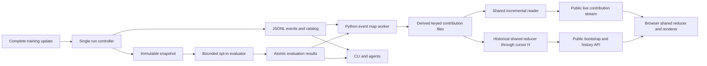

# Metrics first: research and proposed implementation plan

Date: 2026-09-19 (America/Denver). Status: **research and design proposal; no metrics runtime or browser implementation in this change**. Integrate through small PRs targeting `develop`.

## Recommendation

Make metrics a public, file-based contract shared by training, agents, the CLI and the browser. Extend the existing append-only `events.jsonl` and bounded reader; add a versioned catalog describing metric meaning, provenance and presentation. Keep the server independent of training: it streams completed events, serves bounded historical snapshots and leaves live chart updates to the browser. It never re-runs metric reduction to forward an event. Use ordinary importable Python metric factories with explicit inputs, just like other recipe components.

Default-on metrics should cover the actual optimization totals, named weighted components and inexpensive progress information. Every default must be individually removable; an empty preset must really produce no metric values. Disabling observation must never disable an objective or its numerical checks. The owner explicitly selected **opt-in expensive evaluation**, including FID. No viewer action should trigger model evaluation implicitly.

Sampling and metrics should remain distinct concepts within one **observation system**. Samplers produce examples; metrics measure training state, examples or datasets. Both use the same scheduling, snapshot isolation, provenance and typed artifact publication. The design is modality-neutral: images, audio, video, text and structured tensors are possible outputs. The owner endorsed establishing the backbone at the beginning and clarified its shape: **CouchDB-style event views, Python-native maps, shared reducers, no database**. Recommend a small Rust/WebAssembly reducer kernel shared by historical bootstrap and live browser views, subject to an early packaging/performance proof. No general workflow engine or browser Python runtime is needed.

There is no universal scalar objective minimized by both players in a GAN. Provide `loss/d_total` and `loss/g_total`, plus default `loss/total = loss/d_total + loss/g_total` labeled **Combined loss (D + G)**, with its formula visible. It is a diagnostic sum of the completed update's two objectives, not a quality score or a third optimization target. Recipes with a different update structure must declare their totals and formula; do not fabricate D/G metrics for incompatible tasks.

## Verified starting point

Read the [execution ledger](resurrection-status.md), [resurrection plan](resurrecting-hypergan-plan-2026-09-18.md), [viewer contract](local-web-view-plan-2026-09-18.md) and observation/recovery guides before inspecting code. Local `develop`, fetched `origin/develop` and the GitHub branch API all identified `477e63d07a425acfbdb8ea921e1e702e7e700f8a`, the merge of [PR #318](https://github.com/HyperGAN/HyperGAN/pull/318). Its [Foundation CI](https://github.com/HyperGAN/HyperGAN/actions/runs/35459479108) and [Repository integrity](https://github.com/HyperGAN/HyperGAN/actions/runs/35459478934) passed. The main worktree was clean. This research used an external worktree at `/home/martyn/dev/hypergan/metrics-first-research`; no historical audit was repeated.

| Existing implementation | Consequence for metrics |
| --- | --- |
| [Native update](../src/hypergan/training.py) and [replicated updates](../src/hypergan/distributed_training.py) return `d_loss`, `g_loss`, `g_adversarial`, `prior_loss`, `gradient_penalty`, positional `objectives`, and `lr_scale` | Reuse computed values. Add stable objective names and missing decomposition; do not recompute losses for charts |
| [Shared controller](../src/hypergan/run_controller.py) publishes after complete updates; [replicated adapter](../src/hypergan/replicated_execution.py) validates a fixed metric dictionary | Separate numerical completion/finite checks from configurable publication before allowing removals |
| [Event reader](../src/hypergan/run_events.py) validates run/attempt/sequence, complete records and bounded cursors | Reuse its partial-tail, corruption and reconnect semantics. It is forward pagination, not yet a historical range index |
| `events.jsonl` is appended and flushed; checkpoint/manifest publication has separate durability rules | An observed scalar is not proof of a recoverable update. Do not label log flushing as checkpoint durability |
| [Config](../src/hypergan/config.py) has strict tables, defaults and `module:object` factories | Add a real metrics table and torch-free structural validation; unknown fields must continue to fail |
| [Preview snapshots](../src/hypergan/preview_snapshot.py) and [bounded observers](../src/hypergan/bounded_observer.py) isolate observation | Reuse lifecycle ideas, but current small preview output limits and synchronous rendering are insufficient for dataset evaluation |
| [Viewer W2/W3](local-web-view-plan-2026-09-18.md) remain unchecked; package metadata has no `web` extra and tracked code has no `serve` implementation | Plan standalone serving as an explicit deliverable, not an already shipped appserver |

The owner clarified that the server may not have been implemented; proceed from the verified W2/W3 backlog. Public distributed profile routing also remains pending; internal replicated metrics must be qualified without implying public CLI support.

## What the reference dashboard contributes

Reference: mikkel/sliders-conceptmod, pinned to `3e184ad604569328fe93d17959945109e7cf30e7`. Credit mikkel and the contributors to that repository for the dashboard design that prompted this work. The [publisher](https://github.com/mikkel/sliders-conceptmod/blob/3e184ad604569328fe93d17959945109e7cf30e7/scripts/yue2_training_dashboard.py) turns completed JSONL updates into an atomically published browser payload. Its [browser asset](https://github.com/mikkel/sliders-conceptmod/blob/3e184ad604569328fe93d17959945109e7cf30e7/scripts/assets/yue2-training-dashboard.html) provides linked exact-value cursors, raw and smoothed traces, responsive cards, freshness/failure feedback and downloadable data. Explanations distinguish objectives and penalties. These are good product patterns to retain.

Its publisher rescans log history and replaces a full JSON payload each polling cycle; clients fetch the full payload. Resume handling uses filename start steps to prune abandoned tails. Those choices fit a small dedicated dashboard, but HyperGAN needs incremental reads, explicit attempt/checkpoint lineage, bounded payloads and catalog-driven charts. Avoid hard-coded metric fields and recipe-specific HTML string replacements. No source or UI assets are copied by this research PR; any later reuse must preserve the applicable license and attribution.

In the [particle bridge producer](https://github.com/mikkel/sliders-conceptmod/blob/3e184ad604569328fe93d17959945109e7cf30e7/conceptmod/textsliders/particle_bridge_gan.py#L756-L819), `loss` means generator total (adversarial plus particle VIC); `d_loss` is separate. The proposed HyperGAN combined total is our explicit design choice, not an interpretation of that reference field. The [dashboard introduction](https://github.com/mikkel/sliders-conceptmod/commit/01436b915b7dc564e68099bd1fe4690c7dcf20c6) credits mikkel; the repository's [MIT license](https://github.com/mikkel/sliders-conceptmod/blob/3e184ad604569328fe93d17959945109e7cf30e7/LICENSE) records upstream copyright Rohit Gandikota.

## Metric meaning and types

Separate **what a measurement means**, **how it is computed**, and **how it is displayed**. A scalar may be a training observation, a snapshot evaluation or a resource gauge. A chart choice must not determine execution cost.

| Type | Examples | Representation and defaults |
| --- | --- | --- |
| Scalar | D/G totals, weighted penalties, reconstruction, learning rates, step seconds, FID | Finite number with named series, units, scope and source. Cheap existing values default on; FID opt-in |
| Distribution | Real/generated color histogram | Fixed bin edges, counts, sample/pixel denominator and protocol identity; scheduled, opt-in |
| Small structured result | Channel means/stds, per-class summaries | Bounded named scalar outputs or a bounded table artifact; explicit label cardinality |
| Artifact reference | Comparison grid, evaluation report | Immutable indexed file, size/hash/type and origin snapshot; never raw tensor arrays in every event |
| Measurement status | Pending, unavailable, failed, timed out | Explicit status/reason, not zero, NaN or a successful empty output |

Each catalog descriptor needs an ID, title, description/formula, kind, units, phase/owner, input bindings, reduction, sampling cadence, evaluation protocol/source identity, and optional display hints such as panel, scale and color. `direction` is `none` for adversarial losses; use `minimize`, `maximize` or `target` only when meaningful. Never derive a quality badge from a loss trending down.

Record raw loss, effective coefficient and applied contribution where available. For a lazy regularizer, distinguish the interval compensation from its base coefficient and record whether it ran. A skipped lazy application contributes a real zero to that step's total, while the uncomputed raw penalty is unavailable. Do not divide weighted values by coefficients to reconstruct a raw measurement. Named additional objectives should have stable recipe IDs, not positional names that change when a list is reordered.

KL is not an automatic metric for every GAN. A configured KL needs two specified distributions, direction, estimator, normalization, log base and zero-support policy. If KL also participates in optimization, expose both raw and weighted values from the objective. If it is evaluation-only, isolate its computation like other evaluations. Missing required inputs are a configuration error, not a hidden zero.

## Sampling, measurements and modality-neutral observations

Treat a sample as an **example artifact**, not an image-valued metric. A metric may produce a structured measurement or a visualization artifact, but an image alone says neither which role it has nor what was measured. Keep semantic role separate from encoding and renderer.

| Concept | Responsibility | Possible result |
| --- | --- | --- |
| Sampler | Generate or select examples from a declared model/input/seed protocol | Audio clips, an image batch, token sequences, a trajectory, numeric tensors |
| Metric | Measure explicit inputs according to a named protocol | Scalar loss, histogram, feature moments, a per-example error table |
| Artifact | Store a typed immutable payload with provenance | PNG, WAV, UTF-8 text, JSON, another declared safe format |
| View | Map event documents and reduce keyed contributions into a queryable result | Loss series, grouped statistics, bounded sample index |
| Renderer | Present a typed view/artifact | Image grid, audio player, text view, curve, histogram or downloadable file |

A sampler need not calculate any metric. A metric may observe existing loss scalars or a reference dataset without generating samples. A sample can feed several metrics, and a sampler's display preview can be a bounded subset of a larger evaluation sample set. Give shared samples stable IDs, source snapshot/model identity, seed/input identity and protocol hash. Reuse a sample stream only when these contracts match; FID's sample protocol cannot silently become the latest tiny preview batch.

An observation job binds a snapshot/data source, optional sampler, selected metrics and resource policy. It produces measurement records plus artifact descriptors through the same publication system. `role = "sample" | "measurement" | "diagnostic"` is separate from `media_type`, byte length, digest and semantic type. Modality metadata is explicit: e.g. sample rate/channels/duration for audio; color space/range/dimensions for images; encoding/tokenizer identity for text; shape/dtype/axis meanings for structured arrays. A numeric tensor must not be guessed to be an image. Unknown supported artifact encodings remain downloadable/inspectable through a safe generic descriptor view, not automatically executed or decoded as model state.

The renderer registry maps safe declared types to UI components and can grow later; it is not user-supplied executable JavaScript. The v1 implementation can retain current numeric samples and add scalar/histogram plots, while reserving these typed descriptors. Do not claim audio generation/playback or arbitrary modality support merely because the schema can represent it. Keep the existing `sample` workflow independent of metric enable/disable settings; allow an observation job to reuse its snapshot/sampling primitives without duplicating the numerical inference path.

### Event documents, Python maps and shared reduced views

The owner's intended model is **CouchDB-style views without a database**: immutable event documents → Python map → keyed contributions → reduce → materialized view. CouchDB's [view documentation](https://docs.couchdb.org/en/stable/ddocs/views/intro.html) describes maps emitting keys/values and reusable reductions; borrow that conceptual interface, not its database, query server or storage engine. JSONL and ordinary immutable files remain sufficient. No CouchDB, SQLite or hosted service is proposed.

Keep the public vocabulary small:

- **Event**: an immutable fact, such as a completed update, evaluation measurement or sample artifact publication.
- **View definition**: versioned Python map, input event selector, key/grouping schema, reducer ID/version/options and output schema.
- **Contribution**: one bounded map emission with source event identity and emission ordinal.
- **Reducer state**: a bounded mergeable summary for one declared key/range; finalization produces a view value.

Maps run in Python once per document/map revision in a supervised headless projection worker. They consume finite JSON facts and artifact descriptors, not live trainer tensors; no CUDA, network or artifact decoding is needed to build a standard loss view. Materialize their emissions in an append-only derived stream, reusable by every subscriber. Serving reads that stream and forwards contributions unchanged. It does not import custom mappers, rerun training/evaluation, or maintain a new reduced view for each live client. An attached server with a missing projection reports that state; it does not execute arbitrary recipe Python on a page request. Training/observation orchestration owns configured map workers, independently of browser connections.

The default loss view is nearly an identity map, and can use a built-in selector rather than custom code. A custom example is this small:

```python
# Proposed event-view mapper: ordinary Python, no browser code.
def loss_points(event):
    if event["event"] != "train":
        return
    for metric_id, value in event["metrics"].items():
        yield (metric_id, event["attempt_id"], event["step"]), value
```

The framework attaches run/stream/event/emission identity and the source metric definition hash; user code never invents delivery IDs. Definition hash is a mandatory partition in stored contributions, grouping and bootstrap state, even when omitted from the short mapper example, so identically named metrics with different meanings cannot merge. Keys have a declared restricted schema and ordering, not arbitrary Python comparison behavior. Grouping is explicit, for example series + attempt + aligned step bucket. A mapper may emit zero or multiple contributions; cap emissions, bytes and key cardinality. Mappers should be deterministic and free of external side effects so replay is valid. Source/version/config changes create a new map revision and an explicit backfill, never silently rewrite a live projection. Identical mapper/input/config revisions share one contribution stream across views. A view revision separately identifies its map revision plus reducer/grouping/display contract; changing only the reducer or grouping does not rerun Python maps.

A projection record contains all emissions for one source document plus its consumed source cursor, even when it emits nothing. One writer appends a complete record under the projection lock; after a crash, the last complete validated record establishes the restart cursor. Partial tails are repaired under that ownership contract; deterministic emission IDs allow idempotent replay. A changed mapper uses a separate map revision/generation. Persisted output and progress must not be independently advanced in a way that loses emissions. Backfill reads source events under a work budget and advertises its watermark. These files are derived observations, not a second source of truth or training checkpoints.

The **shared reducer** has a small pure interface: `identity`, `add(state, contribution)`, `merge(left, right)` (CouchDB's re-reduce role), and `finalize(state)`. It cannot import Python, fetch artifacts, use a clock/RNG or perform I/O. Most users choose a built-in reducer; only new mathematics needs a custom portable reducer. Finalized values are not automatically valid inputs to merge: average needs sum/count, for example.

| View reducer | Bounded state | Use |
| --- | --- | --- |
| Count/sum | Count or sum with validity | Event counts, additive diagnostics |
| Mean/moments | Count, sum or stable moments | Weighted summaries; never average averages |
| Histogram | Fixed bin identity and counts | Merge compatible distribution measurements |
| First/min/max/last | Values plus stable source positions | Spike-preserving scalar chart buckets |
| Latest / bounded latest-N | Ordered positions and bounded descriptors | Status cards and sample galleries across modalities |

Reduce state must remain bounded per key, and the framework also caps key/window count. No reducer may retain an unbounded list of all documents. Ordered reducers use the declared view key (for example evaluated step), with immutable source identity as a deterministic tie-breaker, not network arrival order; commutativity is not assumed. Late evaluations can arrive out of step order. Define empty/missing/nonfinite behavior and numerical tolerances. Mathematically associative sums can still vary in floating point; fix partition/merge order in deterministic fixtures and do not promise bitwise invariance across arbitrary topology.

For page load, the historical service applies the reducer to mapped contributions through cursor H and returns **reducer state**, definition/version, bucket alignment and coverage—not just rendered points. The browser loads that state and calls the same reducer's `add` for contributions strictly after H. Both call `finalize` for display. This shares the reduction logic while keeping live server fanout free of reduction. Zoom, resize requiring new bucket alignment, changed lineage or incompatible revisions requests a new bounded bootstrap; do not try to subtract arbitrary old contributions from a noninvertible reducer.

Raw source events and mapped contributions remain separately readable for agents. A reduced chart is a view, not canonical measurement truth. Collection keeps experiments separate by run identity; a future central server cannot merge unrelated experiments merely because their series names match. Evaluation maps consume either the authoritative result or its announcement resolved to that result, never both as two measurements.

### Share reducer code, not just an interface

The cleanest literal code-sharing candidate is **one small Rust core compiled to a core WebAssembly module**, instantiated in the browser and in Python through [Wasmtime's Python binding](https://github.com/bytecodealliance/wasmtime-py). The same module digest, reducer config and state schema identify both executions. Maps and tensor evaluation stay Python-native. This is a scoped recommendation from documentation research, not a measured integration result.

| Approach | Assessment |
| --- | --- |
| One Rust/core-WASM reducer, browser + Python/Wasmtime hosts | Recommended proof: genuinely shares implementation and state; introduces a build/runtime dependency to qualify |
| One Rust source, native Python extension + browser WASM | Shares source but requires more platform wheels/ABI maintenance; consider only if Wasmtime cost is material |
| Python + TypeScript reducers from one specification and fixture suite | Simple reference/oracle option; shares semantics, **not implementation**; do not describe it as the requested shared code |
| JavaScript reducer on browser and Node/embedded JS backend | Possible, but adds a second server runtime or embedded-engine boundary to a Python product |
| Python-in-browser runtime | Avoid for this narrow need; neither custom maps nor PyTorch belongs in the browser |

Keep the kernel free of DOM, filesystem, clock, network and WASI requirements. Use a tiny explicit memory/byte-buffer ABI and versioned bounded states; batch contributions across the host boundary. Browser-oriented generated bindings such as [wasm-bindgen](https://rustwasm.github.io/docs/wasm-bindgen/) are not automatically a Python ABI. Pin/build the shared core and its two thin host wrappers together, with identical fixtures in both hosts. No arbitrary remote module downloads. First ship qualified bundled reducers; custom reducer modules need a later explicit ABI/limits contract. Ordinary custom Python maps can already compose existing reducers.

Reducer state includes the bounded mathematical summary; the surrounding engine owns cursor/coverage, deduplication and key/lineage metadata. Do not store an ever-growing set of event IDs inside a sum reducer. Combine cached states only over compatible **disjoint** ranges. Test `merge(reduce(A), reduce(B))` against `reduce(A + B)` with empty partitions, ties, missing values, unequal counts and declared float tolerances. Identical code does not make overlapping coverage safe or remove floating-point order dependence.

The M0 proof should implement mean and first/min/max/last over a synthetic contribution log, build one module, load it in Python and a real browser worker, serialize bootstrap state, and continue it with a live suffix. Measure cold start, call/serialization costs, memory, throughput and package installation on the supported platforms. Verify resource exhaustion terminates the reducer without stopping training. Plain JSONL/catalog/agent reads remain base-install functionality; reduced view serving can require an optional reducer runtime. Failure to install that runtime must be explicit, not a silent Python fallback with different semantics. Choose the final ABI/runtime only after this proof; no benchmark or portability claim is established by this report.

Developer experience is a gate: a new event view should require one short Python mapper and one config entry selecting a reducer, with no HTTP, frontend or trainer edits. Provide a small local map/reducer fixture runner and actionable schema errors. Keep a complete example under roughly 30 lines. Distinguish `metrics` (what to measure), `views` (how facts become queryable results), and renderer hints (how to display them), rather than forcing every author to subclass an all-purpose observer.

### Numerical evaluation is a producer, not the browser view engine

Tensor metrics still need Python/PyTorch evaluation: source → optional sampler → batch statistics → final measurement event. Reuse bounded reducer algebra where it fits, but do not move FID feature extraction or its final matrix calculation into a browser to force a universal execution engine. A FID result can be an ordinary scalar event consumed by the exact same view system as losses. Custom evaluators therefore remain ordinary Python factories; only view reducers that need backend/browser reuse cross that boundary.

Share one bounded sampled batch among compatible evaluators, then release it; retaining sample artifacts is an independent policy. Merge sums/counts for means, counts for fixed-bin histograms, and feature sufficient statistics before finalizing FID. Never average per-rank FIDs. Reference/generated distributions may have different counts; paired task metrics explicitly require matching sample IDs. Bound covariance dimension-squared state as well as batch sizes.

Each numerical partial identifies evaluation, protocol, source namespace and shard/batch range. Reject duplicates, overlaps and incompatible definitions. V1 may restart a crashed evaluation from its pinned snapshot with a fresh evaluation ID/state and the same protocol seed; partial-job resume need not exist yet. Future partial recovery requires atomic accumulator-plus-consumed-identity publication. Empty data is unavailable, not a zero score. None of this replaces GAN optimizer collectives or qualifies multi-host execution.

## Configuration and custom Python interface

The following is **proposed syntax**, not a currently valid recipe. Resolve defaults into explicit descriptors in the run catalog so agents do not need to reproduce preset logic.

```toml
[metrics]
preset = "standard"                 # "none" starts empty
disable = ["timing/step_seconds"]   # exact IDs; unknown IDs fail
every_steps = 1                     # fast scalar publication cadence

[metrics.overrides."loss/total"]
enabled = false

[metrics.custom.color_moments]
factory = "my_project.metrics:ColorMoments"
inputs = { generated = "evaluation.generated", reference = "evaluation.reference" }
mode = "snapshot"
every_steps = 1000
on_error = "disable"                # visible failure; training continues
[metrics.custom.color_moments.args]
color_space = "lab"
bins = 64

[metrics.custom.color_moments.view]
panel = "Color distribution"

[views.loss_curve]
map = "my_project.views:loss_points"
reduce = "envelope/v1"              # built-in first/min/max/last state
group_by = ["series", "attempt", "step_bucket"]
key_schema = ["series", "attempt", "step"]
renderer = "line"
```

Deterministic resolution: expand the versioned preset against applicable objectives; add custom entries; apply explicit overrides and removals; validate IDs, bindings and dependencies. `preset = "none"` with no custom entries disables all metric values, including totals. The small lifecycle stream and mandatory finite/update checks remain operational. Disabling a source's published series does not prevent a derived total from reading an already computed internal value. Configuration makes that distinction explicit.

For fast metrics, `every_steps = N` initially records the current completed step's value at multiples of N; it is not an average of the intervening updates. Snapshot cadence schedules an evaluation of that boundary's snapshot. Any future window aggregate declares its reducer, contributing count and step range as a distinct definition. Keep raw sampled values separate from UI smoothing.

Optional metrics absent from a compatible preset are simply not selected. An explicitly requested factory, input or unsupported execution mode must fail preflight with an explanation. Compatible custom metrics may run with an unqualified warning; do not require a central allowlist. A first implementation must reject histogram/snapshot factories until those capabilities actually land.

Proposed ordinary Python protocol:

```python
class ColorMoments:
    def __init__(self, color_space="lab", bins=64): ...
    def describe(self): ...              # typed output and resource contract
    def evaluate(self, *, batches, context): ...  # Python-native measurement

# The independent loss_points(event) mapper above builds a view of facts.
# Its reducer is selected by a portable ID, not a Python bound method.
```

Constructor arguments and explicit inputs stay in config. `describe()` executes only in runtime preflight/evaluation, never in the server or structural `validate`. Evaluation may internally reuse batch map/reduce helpers, but its public output is a measurement event; Python metric plugins are not required to compile to WebAssembly. Persistent cross-window state would need a versioned state/restore contract; reject it until implemented rather than quietly resetting accumulators. Start with independent snapshot evaluations and disposable per-window state to minimize recovery coupling. A future TorchMetrics adapter can implement this protocol; core configuration, readers and browser serving must not require TorchMetrics or torch.

Two execution boundaries are sufficient initially:

1. Built-in fast metrics select already computed detached scalars. Custom scalar transforms run in a bounded observer on immutable primitive data, not in HTTP handlers or rank update code. No arbitrary expression `eval`.
2. Tensor/data metrics run against an immutable copied snapshot and a separate evaluation iterator/RNG in a supervised process. They cannot receive the live trainer, consume its sampler or mutate its modules. Trusted custom Python is not a security sandbox; limits, deadlines and process cleanup still apply.

Keep numerical recipe identity distinct from the observation spec hash. Today checkpoints fingerprint the resolved recipe; this separation requires deliberate changes to both native and replicated restore validation. Changing display settings must not invalidate numerical recovery. A supported explicit metric change on resume starts a new observation revision and preserves previous catalog versions. Changed definitions create a distinct series identity `(metric_id, definition_hash)`; readers never splice incompatible meanings merely because labels match. Any persisted observer state validates its own factory/version/config identity. Implementation changes may break older checkpoints, as authorized; do not add compatibility shims. Recovery from an earlier snapshot within a supported current run remains mandatory.

## Files, agent interface and recovery

Keep one authoritative trainer event stream. Mapped contributions are explicitly derived, rebuildable view inputs, not another independently authoritative metric log:

```text
run/
  manifest.json                        # current observed/durable state
  events.jsonl                         # lifecycle + completed-update metric rows
  metrics/catalog-<hash>.json           # immutable resolved descriptors
  metrics/artifacts/<evaluation-id>/    # immutable bounded evaluation outputs
  metrics/evaluations/<evaluation-id>/  # evaluator-owned result and receipt
  views/<view-hash>/contributions.jsonl # derived mapped records + source cursors
  .view-cache/                          # disposable indexes/bootstrap states
```

JSONL is straightforward to append, tail and consume one JSON value per line ([format reference](https://jsonlines.org/)). Keep UTF-8, newline-terminated records and strict JSON: no NaN/Infinity. Evolve the event schema explicitly rather than continuing to label incompatible records version 1. Existing reader bounds and corrupt-complete-record errors remain requirements.

Illustrative proposed train row:

```json
{"schema_version":2,"event":"train","run_id":"r1","stream_id":"training","stream_generation":"s1","attempt_id":"a2","sequence":41,"step":120,"samples_seen":1920,"elapsed_seconds":38.4,"catalog":"sha256:...","metrics":{"loss/d_total":1.8,"loss/g_total":1.2,"loss/total":3.0},"measurement_status":{}}
```

The actual manifest remains authoritative for durable progress. Every metric has its owning attempt and source update; evaluation records additionally carry checkpoint/snapshot digest, EMA/live choice, evaluation ID, protocol hash, sample count and measurement/publish times. Late FID results belong to the evaluated step, not the trainer's step when the result arrives. Primitive scalar values keep `jq`, Python and agent consumption simple; descriptors and sparse statuses carry richer semantics.

Only the controller writes `events.jsonl`. Evaluators publish atomic immutable result files; the controller may announce validated receipts during an active attempt. Standalone evaluation after training uses its own indexed result file/stream with the same envelope, never a second writer of training events. Readers merge these by explicit identity, not timestamp guesses. Oversized artifacts live out of line and are served only through the run's artifact index.

An attempt records its parent checkpoint/attempt and restored step. Never delete abandoned metric history. The default chart follows the selected recovery lineage, ending an ancestor segment at its chosen checkpoint; an audit view shows all attempts. Example: A reached 100, then B restored A's checkpoint at 80. The active view includes A through 80 and B from 81, while A's 81–100 remains inspectable. If B performs zero updates, the selected lineage still ends at 80. Smoothing, buckets and indexes must respect these boundaries. A late evaluation of A:100 must not enter B's current curve.

Persist cursors only after consumption; deduplicate events by run/stream/attempt/sequence, and evaluations by immutable evaluation/result identity shared by their result file and controller announcement. Stream generation detects replacement without changing the identity of faithfully replicated events. Detect replacement/truncation, retain partial tails, and surface corrupt complete rows. Derived caches record their source generation, consumed cursor, catalog hash and lineage revision; rebuild them incrementally after mismatch. Never overwrite source records to fix a chart.

Proposed base-install commands:

```sh
hypergan metrics RUN --catalog
hypergan metrics RUN --series loss/g_total --after-step 100 --limit 100 --format jsonl
hypergan metrics RUN --cursor CURSOR --limit 100 --max-bytes 1048576
hypergan metrics RUN --latest --format json
```

These are planned APIs, not commands that work today. Specify filtering/cursor semantics precisely: a page cursor advances across all scanned source records, even if filters produce no values; `has_more`, scanned bytes and partial-tail status remain explicit. Raw export uses bounded pagination and never silently substitutes chart summaries. Optional bounded follow/timeout can follow after the existing finite-page CLI contract.

## Computation and evaluation cost

Use global measurements from the numerical strategy. Do not average arbitrary rank scalars. A sample mean merges sums/counts, a histogram merges counts with identical bins, a maximum reduces by maximum, and a ratio merges numerator/denominator before division. RA, unique-prior regularizers and accumulated objectives need their existing full-batch semantics. Repeated shared/global values must not be counted once per rank or microbatch. FID cannot be obtained by averaging rank FIDs.

Extract detached values only at defined complete-update boundaries. Batch device-to-host transfers where possible; avoid adding one `.item()` synchronization per new metric. No new gradient norms, forward passes, tensor copies, collectives or GPU resource polling should appear under the cheap preset. Displaying a chart never adds any of those operations. Benchmark reductions in cadence before promising lower overhead: current per-step manifest/event work already exists.

For FID, freeze feature extractor/weights, preprocessing/resizing/range, reference dataset manifest and split, sample selection/count, RNG seed, EMA/live weights, implementation version and precision. Cache reference statistics using that full protocol identity. The [original FID implementation](https://github.com/bioinf-jku/TTUR) compares feature means/covariances; [Clean-FID](https://github.com/GaParmar/clean-fid) documents why resizing and compression choices change scores. A qualified adapter must match a pinned reference on a fixed fixture. Choose the backend in the evaluation PR; do not invent another FID implementation or silently download weights. Low-sample diagnostics must be labeled with their counts and protocol, not presented as interchangeable benchmark scores.

For colorization, start with generated/reference channel means, standard deviations and fixed-bin histograms in an explicitly defined color space. Specify pixel versus image weighting, masks, resizing and the held-out reference split. Cache reference statistics by data/preprocessing/protocol identity. Include distribution differences as named scalar summaries and overlaid histograms; these describe color statistics, not semantic or spatial fidelity. A dataset histogram can look correct while every individual image is wrong, so a qualified recipe should also declare a paired/task metric when appropriate.

Begin with checkpoint evaluation on demand or at declared safe boundaries. GPU is the production default; CPU evaluation is explicit. The safe same-GPU policy is serialized evaluation or evaluation after training, with its time visible. Asynchronous evaluation requires an explicit device/resource allocation: a separate process alone does not reserve GPU memory or eliminate contention. Cap active evaluations at one and pending requests at one; coalesce superseded scheduled requests with visible receipts. Pin snapshots while in use, enforce time/sample/artifact limits, and clean up on coordinator death. Do not block the training process group on evaluator work. Current small numeric preview artifacts cannot substitute for an evaluation dataset.

Optional runtime evaluation failures produce visible status/reason and disable or retry only within configured bounds. Configuration incompatibilities fail before training. Required evaluation failure makes evaluation/job acceptance fail explicitly; it must not report qualified success. Mandatory training-state/event persistence failures remain real run failures. Full disks must never be hidden as dropped metrics.

## Browser and server design



Use the existing viewer plan's separate process, loopback/session access, offline assets and headless operation. **Owner refinement: deliver live events as a stream, not periodic browser polls.** Recommend SSE for the first one-way transport, with the same versioned envelopes available through bounded HTTP replay. A WebSocket adapter can follow without changing the event model. A shared reader fans out completed source events or mapped contributions to clients; it validates/frames data but does not re-run metric reducers or rebuild chart history on every update. File-tail wakeups may use bounded polling internally where filesystem notifications are unreliable; that is separate from the streaming client contract.

### Public API and future stream composition

Owner clarification: each server must work independently and be designed for API/WebSocket consumers; HyperGAN's own UI must use that same interface. A future collector might combine a dozen experiment servers. **Design for that composition and implement one live streaming transport in the first viewer; implementing a collector, remote deployment or a second transport is not required in this milestone.**

Put a transport-independent read service below HTTP and any future streaming adapter. Publish a versioned OpenAPI description for HTTP and versioned JSON Schemas for catalog, event, evaluation, page and error envelopes. The first browser uses only those documented endpoints, with no privileged renderer-only data path. Local CLI/file readers use the same schema and query semantics without requiring a server. A future remote agent can consume the service without reverse-engineering the page.

| Planned public surface | Contract |
| --- | --- |
| `GET /api/v1/capabilities` | Supported schema/transport versions, server instance ID, streams and hard limits; advertise WebSocket only when implemented |
| `GET /api/v1/runs/{run_id}` | Current status, lineage, observed/durable positions and stream heads |
| `GET /api/v1/runs/{run_id}/metrics/catalog` | Active revision by default; `revision=<hash>` retrieves immutable historical definitions and safe presentation hints |
| `GET /api/v1/runs/{run_id}/events` | Exact bounded replay page for explicit `stream_id`; cursor, filters, byte/row limits, coverage and next cursor; training and independent evaluation streams are discoverable through capabilities/run metadata |
| `GET /api/v1/runs/{run_id}/views` | View definitions/revisions, mapper identity, reducer module digest/state version, key/grouping schemas and projection coverage |
| `GET /api/v1/runs/{run_id}/stream` | SSE subscription selecting source-event or mapped-contribution streams; heartbeat and explicit reset/gap messages; bounded per-client queues, no live reduction |
| `GET /api/v1/runs/{run_id}/views/{view_id}/bootstrap` | Bounded reducer states, key ranges/bucket alignment, view/reducer/catalog/lineage revisions and exact committed projection cursors |
| `GET /api/v1/runs/{run_id}/metrics/series` | Bounded plot query; explicit reduction, definition identity, lineage and index coverage |
| `GET /api/v1/runs/{run_id}/artifacts/{artifact_id}` | Indexed artifact access; no host-local paths in the public contract |

Define a subscription request as streams/run IDs + accepted schema versions + last processed cursor per stream + filters + byte/event budgets. Responses use the same event envelopes as HTTP, plus `ready`, `heartbeat`, `gap`, `reset_required` and stream-scoped terminal/error messages. A run subscription automatically includes future indexed streams matching its selector and emits `stream_added` before replaying their records from the beginning; run/catalog/view/lineage changes are control messages on that subscription. Stream registration must be published atomically and rediscoverable after server restart. This avoids metadata polling to discover post-training evaluations. Training completion does not close the run subscription or future standalone evaluation streams. [WebSocket](https://www.rfc-editor.org/rfc/rfc6455) is a transport; application replay, progress and bounded queues still require this protocol. The [SSE standard](https://html.spec.whatwg.org/multipage/server-sent-events.html) supplies event framing and reconnection IDs, but application replay remains our responsibility. Use the established browser session for EventSource; credentials never enter query strings. A single multiplexed stream per page avoids a connection per metric.

Commit a browser/collector resume cursor only after the entire frame has been applied. Native EventSource's last received ID is not proof that a worker applied or persisted reducer state; track an application bookmark and explicitly reopen from it after processing failure. A frame can batch exact contributions without reducing them. Heartbeats do not advance data cursors. Disconnection/reconnection is visible; do not silently fall back to periodic dashboard polling.

Keep a stable run UUID and immutable event identity across serving locations. A server instance ID identifies the current endpoint incarnation, not the experiment. Stream cursors are opaque and bound to stream generation; today's directory/inode-bound file cursors are not portable network identities. The service wraps/replaces that storage detail and returns an explicit reset if a cursor cannot be resumed. A collector persists each source cursor only after ingesting its page and deduplicates event identities. There is no global order across servers: retain producer attempt sequence, source step and producer timestamps, plus collector receipt time; do not order experiments by unsynchronized clocks.

Delivery is replayable and at least once, not exactly once. A slow consumer gets a bounded queue and a visible gap/resync response or disconnect; it never backpressures training and never silently loses raw events. A latest-value-only subscription can coalesce updates only when explicitly requested and labeled as a projection. Replay retention/truncation is discoverable; a collector that falls behind must fetch available history or record the gap. Single-run serving is enough initially; run IDs in routes allow multiple runs later without changing every endpoint.

Future remote attachment needs explicit endpoint authentication and TLS/tunnel policy. Preserve the initial loopback/session contract; this proposal does not open listeners publicly. Keep transport credentials outside run artifacts. Federation, experiment search, cross-run comparisons, multi-tenant permissions and central storage remain later work. M3 must nevertheless include an independent API-client test showing that the browser's exact same interface supports catalog discovery, catch-up, reconnect and raw export.

For initial load, reduce mapped history only through a captured complete projection watermark, return bounded reducer states and that cursor, then replay/stream strictly after it. Events produced while the page loads are replayed before tail following, so the snapshot-to-stream transition has no silent gap. Never pair an old projection state with a newer trainer-file cursor: advertise the projection's actual coverage and lag separately from the source head. View/reducer/catalog/lineage revisions accompany the snapshot; intervening changes appear as events or force a new bootstrap. Duplicate delivery is harmless only after engine-level deduplication, before `add` is called.

Use ETags for unchanged small metadata responses. Recent exact events live in a bounded ring; a disposable byte-offset index supports history lookup. Historical chart reduction is a budgeted bootstrap/zoom operation and can be cached by source watermark/range/definition/reducer version. It is not on the live fanout path. Cold queries report indexing/partial coverage rather than blocking a handler on a complete log scan. If very large runs require precomputed plot summaries, make that a separately bounded offline/background view-index job, not a reducer invoked per connected viewer or mandatory live update. Do not claim arbitrary history queries are cheap until an index exists.

For overview curves use per-bucket first/min/max/last points in temporal order, retaining spikes and missing-data boundaries. Return source spans, counts and the aggregation mode; browser smoothing is a clearly labeled display transformation. Zoom requests finer data. Never compute FID, percentiles or distribution distances from plotted/downsampled points. Bound response-wide points across all requested series, not just per-series.

There are three distinct operations: **metric reduction** runs once at the producer/evaluator; **historical view reduction** compacts already completed measurements for initial load/zoom; **client view reduction** deduplicates mapped contributions and updates the shared bounded reducer state. Only the latter runs in the client for every live contribution; live server fanout runs neither reduction. The client applies the shared view reducer to mapped contributions in a worker, while server fanout forwards those contributions unchanged. Chart summaries are lossy views and can never replace raw agent exports or numerical reducer state.

Recommended first chart engine: **a modular Apache ECharts build**, behind a small renderer interface; verify with a scalar-plus-histogram spike before freezing the dependency. Its [modular imports](https://echarts.apache.org/handbook/en/basics/import/) let us include only needed chart/components, with one engine for lines and distribution views. [uPlot](https://github.com/leeoniya/uPlot) is the lighter alternative if scalar-focused startup and browser budgets dominate. Prefer ECharts provisionally because the requested metric variety matters more than minimizing JavaScript at any cost; server efficiency primarily comes from the read/index contract. Bundle a pinned licensed build offline. Do not ship two engines by default, add CDN dependencies, or write a bespoke general plotting library. Published library benchmarks are not HyperGAN measurements.

The default page should have a compact run/status strip showing observed update, durable update, freshness and evaluation state; then a loss overview, D and G component panels, timing, task metrics and previews. Stable colors and linked cursors connect panels. Show raw traces faintly with optional smoothed overlays; allow linear/log/symlog where valid, metric search/pinning, panel collapse, zoom/reset and exact-value/download access. Show sparse evaluation points at their source step with sample count/protocol in the tooltip. Avoid connecting lines across attempts or missing data.

Catalog display hints provide sensible grouping, while the browser permits local layout preferences without editing the recipe. Never execute plugin-provided HTML/JavaScript; render user text as text. Keyboard controls, accessible labels, non-color distinctions, a numerical table and export are part of acceptance. A future renderer registry can add image/audio/table views without changing metric computation or allowing arbitrary browser plugins.

Initial **benchmark targets, not measured results**: live flushed-event-to-browser p95 below 1 second; at most 8 visible charts/32 requested series; at most 2,000 plotted points per series and 16,000 points/1 MiB per historical response; 64 KiB scalar rows and explicit histogram/artifact bounds. Bound stream frame/queue bytes separately (initial candidate: 1 MiB queued per connection) and disconnect/resync on overflow. On this workstation, target under 1% median training-throughput regression for default metrics, under 2% additional regression with five viewers, warm-query p95 below 100 ms and viewer-server RSS below 256 MiB on a synthetic million-update log. Fix device, workload, repetitions and noise thresholds before measuring. Measure slow-disk/rebuild behavior separately; these are acceptance candidates to tune from evidence, not current guarantees.

## Small PR sequence and evidence gates

| Slice | Deliverable | Required evidence |
| --- | --- | --- |
| M0: shared reducer proof | One Rust/core-WASM module for bounded mean/envelope reducers, Python and browser-worker hosts | Identical module/state fixtures, bootstrap+live-suffix equivalence, coverage/duplicate rules, bounded calls/memory, install and serialization measurements; choose ABI from evidence |
| M1a: event/view backbone | Distinct sample/metric/artifact contracts, modality-neutral events, versioned Python map definitions, bounded materialized contributions, shared reducer descriptors, base replay pages | Zero/multiple emissions, map replay/backfill/corruption, bounded state/key count, same mapper shared by multiple views, no Python maps in HTTP, no database |
| M1b: metric defaults | Stable named outputs, catalog/schema, removable default metrics, numerical/observation/view identity separation | Default/none/per-ID cases; strict config; loss decomposition including zero coefficients/lazy penalties; no torch imports for read/validate; native/replicated completion validation intact |
| M2: complete runtime integration | Native and internal replicated publication, cadence, current-run resume and explicit lineage | CPU/CUDA and full two-GPU comparisons, accumulation/global reductions, metrics on/off identical numerical state, earlier-snapshot and zero-update replay, partial D/G failure never emits a complete metric row |
| M3: reader and standalone viewer | Standalone `serve` and optional `web` packaging, versioned public API/schemas, shared live SSE fanout, bounded bootstrap/history and offline charts using that API; implements W2 | Independent API client and browser share discovery/replay/export, including new post-training streams; no-reduction live fanout, gapless bootstrap handoff, million-row/slow-client/cold-index budgets, five-client fanout, partial/corrupt tails, cache invalidation, lineage gaps, keyboard/table access, planned session/traversal protections; serving imports no training runtime |
| M4: custom and task evaluation | Bounded scalar factory and snapshot protocol; color moments/histogram example; explicit FID adapter | Factory errors/source identity, timeout/cleanup, queue coalescing, fixed-data reference parity, no sampler/RNG/module mutation, provenance/cache invalidation, unavailable results visible, no implicit weight downloads |
| M5: local startup integration | Automatic local startup and train/resume server flags over standalone serving; completes W3 | Headless no-socket path, startup and mid-run server failure, viewer on/off numerical equality, worker cleanup, installed-package walkthrough |

M0 is a bounded implementation spike, not permission to build a general compiler. M1 is split into M1a/M1b to keep the backbone and numerical identity changes reviewable. M1/M2 can land before the public distributed CLI cutpoint, exercising its internal adapter. Coordinate schema/controller edits with that work; avoid duplicate orchestration paths. M3 depends on the event/view contract, while M4 need not delay useful loss charts. W4 remote viewing remains tied to actual cluster qualification and its agreed transport/allocation. No paid compute or release is authorized by this plan.

Use focused CPU fixtures and base-only checks, then installed wheel/sdist and required CI for each implementation slice. Use the two owner-authorized local GPUs for relevant numerical/recovery gates; an NCCL diagnostic alone is insufficient. Do not broaden this research PR into implementation. The immediate next action is M0: prove one reducer implementation can bootstrap in Python and continue in the browser with the same bounded state. Then implement M1's event→Python map→shared reduce path and metric defaults. Ship this small working backbone before adding modality renderers, multi-host evaluation or general job graphs.

## Research validation and remaining decisions

Three subagents independently researched the reference dashboard, runtime/config/recovery integration, and server/charting options; the coordinator reconciled their findings. Read-only verification used `git status --short --branch`, `git log`, `git worktree list`, `git fetch origin develop`, `gh pr list`, `gh api repos/HyperGAN/HyperGAN/branches/develop`, branch-protection inspection and `gh run list`. Required branch checks remain strict; no bypass is planned. The documentation PR runs whitespace/link/example checks and required GitHub CI; no training benchmark was run for this research.

Confirmed preferences: expensive metrics are explicit opt-in; standalone serving exposes the same composable public API to the browser and external consumers; live events stream without server re-reduction; sampling and measurement have distinct roles in a modality-neutral backbone; events are documents mapped by Python into CouchDB-style views using shared reducers, without a database. Keep authoring clean and small; v1 need not implement every modality or federation. The owner accepts the verified server backlog. Remaining engineering gates: M0 qualifies the shared reducer ABI/runtime, M3 validates the renderer and streaming budgets, and M4 pins the FID backend. All configuration, protocol, CLI and endpoint examples above are proposals. Current implementation evidence stays in the ledger; these plans do not claim shipped metrics, a browser server or qualified image evaluation.
