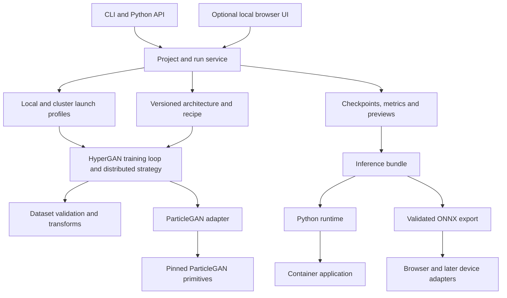

**Resurrecting HyperGAN — consolidation and implementation plan, 2026-09-18**

HyperGAN should make it easy to train, build, and deploy proven GANs for distinctive applications, from a workstation to a GPU cluster. Adopt ParticleGAN for the first numerical foundation; let HyperGAN own the complete training loop, data preparation, distributed execution, sampling, artifacts, and deployment experience.

The recommended starting point is a small, complete image-generation workflow, supported by an exact upstream reference benchmark and an early multi-GPU/multi-node implementation. The long-term product is a curated collection of state-of-the-art GAN applications with tested training and deployment profiles. Research must be mature before it enters the supported product. Preserve historical experiments through Git archives rather than carrying them into the supported package.

The owner's clarified requirements are reflected throughout this plan: cluster training is a foundational requirement; HyperGAN may control and reshape the training loop for usability; and expansion should integrate established research for unique use cases, avoiding the former accumulation of unfinished experiments. A single-device run remains a correctness reference, not the product's scope limit.

This is the evolving design and release checklist. The initial source/branch audit is preserved below as historical evidence; the clean CPU foundation and legacy branch retirement have since landed through PRs #298–#301. See [the execution ledger](resurrection-status.md) for current completion evidence. The subsequent [complete issue audit](issue-audit-2026-09-18.md) records the disposition of every issue, and the [local browser view contract](local-web-view-plan-2026-09-18.md) replaces the archived desktop-viewer direction. Implementation claims require linked evidence; planned capabilities remain unimplemented until their gates pass.

## Accepted first-session scope

The owner approved coordinator-reviewed and coordinator-merged PRs targeting `develop`, with subagents working in separate worktrees. The first stopping point is a clean, installable foundation with a bounded HyperGAN-owned ParticleGAN CPU reference, modern CI, preserved history, and retired legacy code. Image quality, complete training resume, GPU and cluster qualification follow. See [the live execution ledger](resurrection-status.md) for evidence and remaining work.

Recipe configuration owns generator/discriminator/optional encoder/auxiliary components, constructor parameters, explicit input/output bindings, losses, regularizers, optimizers and schedules. Built-in identifiers and explicit importable Python components allow custom architectures without the old layer DSL. Conditioning and paired inputs must be representable for future colorization and super-resolution recipes; a tiny paired fixture validates the contract. Default numerical settings follow pinned ParticleGAN, including b-cap and VICReg. Custom combinations run with an unqualified warning; qualification is tied to resolved settings, component versions and execution profile. Actual incompatibilities fail loudly, with no silent component substitution or ignored settings. Configurability alone makes no quality/distributed/deployment claim.

## Execution checklist

**Recommended order: preserve and simplify branches → establish honest CI → add ParticleGAN and the new loop → remove replaced code → complete recovery/data contracts → prove multi-GPU → prove two-node training → finish the user journey and deployment → release.** Start the next version with the first implementation PR; release it after these gates pass. Treat each numbered item as a milestone with one or more small PRs. Check it off only when its stated evidence is linked. Milestone completion is recorded with evidence in [the execution ledger](resurrection-status.md).

- [x] **1. Preserve the project and close the branch backlog.** Refresh the branch/PR inventory, back up uncommitted work, create archive tags and a verified Git bundle, and restore it in a temporary checkout. Preserve and advance the existing `develop` branch as the next-release integration branch; retire the already-merged `fix/examples` branch after checking references. Record selected `fastgan`/`nd` ideas as concrete extraction tasks with source commits, then archive their tips and the unfinished Electron/StyleGAN/OmniGAN work. Resolve old PRs with an explicit disposition; keep an unresolved one only if it has an owner and next action. **Done when:** every old branch/PR is closed, archived, or assigned a specific integration task; nothing unique is lost and no idle divergent branch remains active by accident.

- [x] **2. Make CI useful before rewriting the runtime.** Replace obsolete CircleCI/release scripts with GitHub Actions and modern package metadata. Establish clean wheel/sdist installation, lightweight CLI entrypoints, configuration validation, and a documented supported Python matrix. Record known legacy failures separately with an explicit retirement decision; do not claim the old runtime works or hide new failures behind blanket skips. Start the new package/test boundary here and add required checks as each capability lands. **Done when:** a fresh checkout builds/install-tests the intended package, required checks are green, and deliberately breaking a supported command makes CI fail. No GPU purchase is needed for this milestone.

- [ ] **3. Land ParticleGAN inside a HyperGAN-owned loop.** CPU reference, configurable components, EMA and inference reload are implemented in PR #301, and complete two-process CPU updates are implemented in PR #308; explicit upstream licensing remains open, so this broader milestone stays unchecked. Resolve upstream licensing, pin the dependency/runtime, and reproduce the tiny reference run. Define the next-version configuration, recipe and execution-profile schemas. Implement the first G/D/prior step, EMA, named RNG streams and run events through the new loop; add a small multi-process correctness fixture immediately. Declare a working version such as `2.0.0a1` after confirming release history rather than saving versioning until the end. **Done when:** the new CLI runs a bounded reference experiment, numerical comparisons pass, and every result records its source/config/runtime. This is the next version's foundation.

- [x] **4. Remove the superseded code and repair the documentation.** Delete the archived TensorFlow catalog, obsolete backends, abandoned viewers, unused dependencies and broken examples from the supported tree in focused PRs. Keep only code needed by the new workflow or a named extraction task. Replace old quickstart promises with commands that CI actually exercises; retain historical docs through the archived release. **Done when:** the installable package contains the supported implementation, default imports do not reach legacy code, and every shipped recipe/example has a purpose and owner. Do this after the replacement reference path works, before porting extra features.

- [x] **4a. Distill the complete issue backlog.** Review every open and closed issue and its discussion, preserve individual dispositions, close obsolete open reports with specific explanations, and retain concrete release requirements. See [the issue audit](issue-audit-2026-09-18.md). Refresh this audit at release boundaries; a closed historical issue is not proof of a working replacement.

- [ ] **5. Qualify one image recipe and make runs recoverable.** [CPU recovery and deterministic image-folder input](core-recovery-2026-09-18.md) are implemented and tested; the [core observer workflow](core-observation-2026-09-18.md) adds periodic previews, reconnect cursors and safe save requests. Image architecture/quality qualification remains open. Extract the candidate architecture cleanly; implement folder validation, a dataset manifest, fixed evaluation samples, complete checkpoints, resume and native inference bundles. Predeclare the image quality/diversity/resource protocol and reproduce it across seeds. Explicitly separate transfer initialization from resume. **Done when:** a bounded own-data run can be interrupted, resumed, evaluated and loaded for inference in a fresh process without losing state or overwriting samples. This is the state contract distributed recovery will build on.

- [ ] **6. Prove single-node multi-GPU training.** Run the same project through a qualified synchronous replicated strategy on two GPUs. The [CPU checkpoint](core-distributed-2026-09-18.md) uses explicit post-backward gradient reduction; GPU execution and any future DDP-hook implementation need their own numerical qualification. Verify global-batch/loss/prior semantics, accumulation, exact gradient penalties, optimizer/EMA state and global metrics against controlled single-process results. Exercise worker failure and coordinated checkpointing. Use existing local GPUs if available before renting them. **Done when:** numerical fixtures and a real small image workload pass; there are no deadlocks, state drift or silent objective changes, and a throughput/memory report is attached.

- [ ] **7. Prove multi-box training with a bounded compute allocation.** Select one provider/scheduler profile, verify real two-node access and networking, then run staging → rendezvous → training → worker failure → whole-job restart → evaluation → artifact retrieval. Reuse the same worker image, loop and run contract from step 6. **Done when:** evidence identifies two distinct hosts, successful fixed-world-size recovery, quality at a matched update/global-batch budget, cost and cleanup. A mocked launcher, two processes or two GPUs on one host do not close this item. Cluster training remains a release requirement.

- [ ] **8. Complete the user-facing workflow.** Make `new`, data checks, `train`/`submit`, status/logs/cancel, `resume`, sampling and inspection coherent across local and cluster profiles. Add actionable errors, sensible defaults, progress/resource estimates and a tested start-to-finish walkthrough. Implement the [optional local browser server](local-web-view-plan-2026-09-18.md), with a `--no-server` escape hatch, independent reconnectable observation and headless cluster workers. Stabilize its event/artifact read contract during step 5; implement the viewer after that contract settles. **Done when:** first-time users can finish the workflow without maintainer intervention or manual Python edits; disconnecting the client does not kill a job.

- [ ] **9. Build and deploy a useful generator.** Produce the native bundle, validated ONNX CPU profile and runnable inference container. Test fixed-input output parity, preprocessing/prior sampling, startup, memory and latency outside the training environment. Select a concrete first application, such as an embedded visual generator, and exercise its deployment. **Done when:** a documented build command produces an artifact another application can load and use; the support matrix names exactly which targets work. Broader browser/mobile and inference-cluster serving follow their own qualification gates.

- [ ] **10. Ship the next version and admit the next use case.** Publish a tested prerelease, run the full installation/image/distributed/export gates, complete the legacy migration guide and branch cleanup, and collect trial-user feedback before stable release. **Done when:** a tagged package and matching docs reproduce the supported journey, remaining limitations are explicit, and each supported recipe has an owner. Choose the next mature GAN/application using the research-admission checklist; do not reopen the old experiment catalog wholesale.

**The pieces missing from a cleanup-only sequence are complete run state, objective correctness across ranks, image-quality qualification, and actual deployment.** A green build and a job using several GPUs would not establish those. Keep data/checkpoint/artifact schemas and a distributed numerical fixture early; pay for the full two-node check only after cheap tests and single-node execution pass. Branch cleanup and a CI skeleton can proceed alongside provider access checks. UI polish can follow a stable run service. Do not delay cluster architecture until after shipping the new loop.

**Use local validation first and reserve the owner's $30 Modal credit for later cluster qualification.** No paid compute is authorized for the first foundation session. The owner is willing to spend more later; choose a concrete allocation and exact job before doing so. Credit is not a promise that all two-node qualification will fit. Start with existing local GPUs only after CPU correctness and recovery gates pass.

Modal is a candidate, subject to access and price checks. Its current multi-node feature is beta, and clustered functions require full GPU nodes; the documented H100 profile uses eight GPUs per node. That can make a tiny two-box test much larger than two GPUs. Verify account eligibility and supported topology before choosing it. See [Modal multi-node documentation](https://modal.com/docs/guide/multi-node-training).

For scale, Modal currently lists H100 GPU tasks at $0.001097 per GPU-second: a two-node, eight-H100-per-node job is about **$63.19/hour for GPUs alone**, or **$15.80 for 15 minutes**, before CPU, RAM, storage and other charges. This is a planning calculation, not a quote; check live rates before launch. A provider or existing cluster that exposes two smaller GPU nodes may fit the test better. Keep the provider adapter small so the qualified loop is portable. See [Modal pricing](https://modal.com/pricing).

Before any paid run, configure credentials through the provider's local authentication or a scoped CI secret, select the explicit allocation, and generate the exact job specification plus an estimated total cost. Keys should never enter this report or Git. Give each job a timeout and bounded retry count, serialize initial paid tests, and record actual spend/artifacts after every attempt. Use available provider limits plus a launcher budget check with headroom for delayed billing and cleanup. Stop before the remaining budget cannot cover the next attempt and its overhead. Do not make paid cluster tests automatic on every PR; trigger them deliberately for training/distributed changes and release qualification. A key provides access; it does not supply a spend limit.

## Audit and design details

**The foundation should change through a dependency and a new implementation inside HyperGAN's existing history.** “Rebase on ParticleGAN” should mean adopting its implementation as the technical foundation. Advance the existing `develop` branch with preserved `master` ancestry, then create short-lived implementation branches and reviewed PRs targeting `develop`; preserve the historical line with archive tags. A Git rebase across the two unrelated projects would not establish a useful maintenance relationship.

| Decision | Recommendation | Reason |
| --- | --- | --- |
| GAN foundation | Pin ParticleGAN in the training/runtime extra behind one small integration module | It already exposes an installable API; HyperGAN can own the application without duplicating the math |
| Repository identity | Keep HyperGAN's repository, history, package name, and community | Preserve attribution, issues, and migration context |
| Default workflow | Folder of images → validated recipe → training → samples → portable bundle | A complete user outcome provides a clear standard for scope |
| Architecture configuration | Named, versioned recipes and ordinary PyTorch modules | Avoid rebuilding the old layer language before the basic product works |
| Research compatibility | Archive old runtime/configs; selectively migrate useful concepts | Maintaining every experimental GAN would recreate the present maintenance burden |
| Initial execution design | CPU diagnostics/inference; Linux CUDA single-GPU, multi-GPU and multi-node training | Build cluster semantics into the first loop and qualify a real two-node profile early |
| Training-loop ownership | HyperGAN owns update scheduling, precision, distributed coordination, recovery and observability | Upstream primitives should disappear behind a coherent user workflow |
| Long-term recipe catalog | Proven GAN architectures and task-specific training/deployment profiles | New research enters only after reproducible evidence and product qualification |
| Interface order | CLI and Python API first; local browser UI over the same run service next | One execution path makes behavior consistent and testable |
| Deployment order | Native inference bundle, ONNX CPU, container, browser; mobile later | Each target must load and run an actual artifact before it is called supported |

The assumed initial audience is artists and developers making custom visual generators, followed by teams training larger specialized models and embedding them in applications. Initial image resolution, reference GPU, cluster topology, and runtime versions must be fixed by the baseline work. This plan assumes a small maintainer team and access to a two-node CUDA test allocation; it makes no paid infrastructure commitment. Phase estimates are provisional engineering effort, not promised delivery dates. The provider/scheduler is unspecified: use plain `torchrun` as the worker contract, then select one affordable two-node adapter during the execution checklist. Modal is a candidate if access and full-node costs fit; Slurm is a candidate when an existing cluster is available.

**The current repository contains useful product intent but cannot serve as the reliability baseline.** The audited HyperGAN head is `291ddccda847e4f4ccb273bb26121a0a0d738164`, dated 2021-01-24. Live `origin/master` still matches it. There are 417 tracked files, including 203 Python files under `hypergan/`; 72 of those are under `needs_pytorch`. The active package, legacy TensorFlow modules, examples, and tests span multiple incompatible generations.

Observed evidence at that commit:

| Area | Evidence | Consequence |
| --- | --- | --- |
| Installation | `setup.py` declares version 1.0.6, uses manually assembled packages, installs `bin/hypergan`, and declares no runtime dependency list | Building a package does not establish that its CLI can start |
| First command | `python bin/hypergan --help` failed on missing `hyperchamber` before displaying help in the audit interpreter | Lightweight commands need to work without loading the training stack |
| Command contract | CLI reports 0.10.0 alpha; advertises `test` without a matching runtime dispatch; backend help differs from runtime names | Generate help and command behavior from one supported interface |
| Syntax/configuration | Static parsing found errors in `hypergan/gans/configurable_gan.py`, two legacy optimizer files, and two component loss JSON files | An importable, parseable supported tree must become a release gate |
| Tests and CI | 12 of 18 `test_*.py` files import TensorFlow; `circle.yml` provisions Python 3.5.3 and TensorFlow | Existing test count is not evidence for the current PyTorch runtime |
| Checkpoints | `hypergan/trainable_gan.py` saves/loads optimizers, but no complete schema/RNG/data-position record was found | Preserve the recovery intent; existing saves are not an established exact-resume format |
| Export | `StandardGAN.build` calls `torch.onnx.export`, but exports a fixed `generator.onnx` with opset 11 | Retain the export objective; redesign and test the actual deployment contract |
| Build path | CLI build supplies a blank `ImageLoader`; `StandardGAN` calls `inputs.next()`, which accesses `dataloaders` before its blank-input guard | The normal build route has a statically identified failure before export |
| Documentation | README promises broad platform support and a viewer; Pygame tutorial still uses TensorFlow Lite | Rewrite supported journeys and archive historical instructions |

These are source observations and limited smoke results, not a full characterization of every historical environment. Source anchors: [packaging](https://github.com/HyperGAN/HyperGAN/blob/291ddccda847e4f4ccb273bb26121a0a0d738164/setup.py), [CLI entrypoint](https://github.com/HyperGAN/HyperGAN/blob/291ddccda847e4f4ccb273bb26121a0a0d738164/bin/hypergan), [runtime CLI](https://github.com/HyperGAN/HyperGAN/blob/291ddccda847e4f4ccb273bb26121a0a0d738164/hypergan/cli.py), [checkpoint code](https://github.com/HyperGAN/HyperGAN/blob/291ddccda847e4f4ccb273bb26121a0a0d738164/hypergan/trainable_gan.py), [standard GAN](https://github.com/HyperGAN/HyperGAN/blob/291ddccda847e4f4ccb273bb26121a0a0d738164/hypergan/gans/standard_gan.py), [image loader](https://github.com/HyperGAN/HyperGAN/blob/291ddccda847e4f4ccb273bb26121a0a0d738164/hypergan/inputs/image_loader.py), [old CI](https://github.com/HyperGAN/HyperGAN/blob/291ddccda847e4f4ccb273bb26121a0a0d738164/circle.yml), and [Pygame tutorial](https://github.com/HyperGAN/HyperGAN/blob/291ddccda847e4f4ccb273bb26121a0a0d738164/docs/tutorials/pygame.md). Relative links describe the audited tree and may move during implementation; its commit is recorded above.

The historical issue backlog reinforces the priorities; [the full issue audit](issue-audit-2026-09-18.md) now records each disposition and retained requirement. Users report missing Windows commands, a missing module entrypoint, configuration discovery failures, missing imports, and resumed sample files being overwritten. These should become explicit acceptance scenarios, rather than being lost during cleanup. See [#286](https://github.com/HyperGAN/HyperGAN/issues/286), [#287](https://github.com/HyperGAN/HyperGAN/issues/287), [#285](https://github.com/HyperGAN/HyperGAN/issues/285), [#288](https://github.com/HyperGAN/HyperGAN/issues/288), [#293](https://github.com/HyperGAN/HyperGAN/issues/293), and [#213](https://github.com/HyperGAN/HyperGAN/issues/213).

**Keep user outcomes; require evidence before retaining implementations.** “Keep” below preserves a capability or concept. It does not imply that existing code should be copied unchanged. “Retire” removes a feature from the supported distribution and current documentation while preserving its history. “Defer” requires a concrete use case and acceptance test before reintroduction.

| Existing area | Disposition | What the resurrected project should do |
| --- | --- | --- |
| `new`, `train`, `sample`, `build`; Python API | Keep workflow, replace implementation | Consistent commands and API operating on the same project/run objects |
| Folder datasets and image transforms | Keep, selectively port | Explicit crop/resize/channel policy, preflight preview, corrupt-file accounting, deterministic validation split |
| Dataset presets/downloads | Keep a small curated set | Checksummed, documented datasets with size and usage information; one download-free synthetic demo |
| JSON/TOML configuration | Keep reproducibility, replace schema | Canonical TOML project file, resolved JSON run manifest, schema version, precise validation; targeted legacy JSON inspection |
| Hyperchamber selectors, dynamic class strings, layer DSL | Retire from supported core | Named registries and typed configuration; advanced extension through normal Python modules |
| `StandardGAN`, component factory, configurable G/D | Replace | ParticleGAN adapter plus a small number of tested architectures |
| Losses, latent distributions, training hooks, optimizers | Replace baseline; archive experiments | Use ParticleGAN's chosen primitives without reimplementing them; keep only application-level callbacks for progress, checkpointing, and evaluation |
| `needs_pytorch/**` | Retire as one archival set | Do not port the TensorFlow research catalog as part of resurrection |
| Custom attention/resizable/layer experiments | Defer | Bring back only when they improve a named use case and pass shape, training, and export tests |
| Single-device training | Keep, replace loop | Correctness reference sharing the same run/step contract as distributed training |
| Multi-GPU and cluster training | Foundational capability, new implementation | Synchronous replicated training, deterministic data sharding, coordinated checkpoints, job submission and recovery from the outset; qualify DDP separately if adopted |
| Round-robin/Hogwild/TPU backend machinery | Retire implementations | Preserve useful operational requirements; replace custom scheduling with tested distributed primitives and launcher profiles |
| Static grids and random samples | Keep | Stable evaluation inputs, saved previews by default, comparison across checkpoints |
| Batch walks, factorization and latent exploration | Keep creative intent, reimplement later | Distinguish learned-prior sampling from off-prior interpolation; capability-aware controls |
| Aligned GAN, colorizer, super-resolution | Defer implementation; retain as next application candidates | Paired data contracts and task metrics before a supported recipe |
| Character/text, video/next-frame, sequential MNIST, classification | Archive examples; defer support | Do not market toy or experimental scripts as general text/video/classification products |
| Tk/Pygame viewer and Electron branch | Keep preview/control requirements, replace clients | Optional local web UI with reconnectable progress, run history, sampling, and cancellation |
| Model saving/sharing | Keep, redesign format | Separate resumable training state and portable inference bundles |
| ONNX build | Keep, rebuild | Target-specific export, validation, manifest, and runnable example |
| Old TensorFlow graph/TFLite/mobile instructions | Retire from current docs | Preserve legacy documentation under an explicit historical version |
| Research sweeps/config generators | Retire implementation; keep bounded job comparisons | Queue reproducible runs of qualified recipes through cluster profiles; broad architecture search stays in research |
| Documentation, tutorials, sample gallery | Keep intent, rewrite around tested journeys | Installation → first result → own data → resume → embed, with known limitations beside each example |
| `deploy.sh`, old CircleCI, unpinned requirements | Replace | Modern package metadata, tested wheel/sdist, locked tested environments, CI, staged releases |

**ParticleGAN supplies the numerical foundation; HyperGAN supplies the application.** The audited upstream revision is `f946b4ed468ff3b3eae5a3bca11411d5725f1181`, dated 2026-09-17, with package version 0.5.0. Use this exact source revision for the initial comparison and record the released wheel hash before selecting a distributable dependency pin. A moving `master` dependency would make training results and exported artifacts difficult to reproduce.

ParticleGAN exposes priors, adversarial losses, critic penalties, prior regularization, recipe helpers, and optional DDGAN/UCD/autoencoder components. Its public recipe API leaves architectures and the training loop to the caller. That boundary fits the proposed HyperGAN role. See the [pinned package](https://github.com/255BITS/ParticleGAN/tree/f946b4ed468ff3b3eae5a3bca11411d5725f1181/particlegan) and [reference PyTorch loop](https://github.com/255BITS/ParticleGAN/blob/f946b4ed468ff3b3eae5a3bca11411d5725f1181/examples/pytorch_loop.py).

Use a normal package dependency rather than vendoring or a submodule. Keep integration tests against the pinned release; upgrade through a PR that reruns the reference and image acceptance suites. If a required capability is missing, propose it upstream or isolate a small temporary adapter with a removal condition. Do not import `experiments/` as an implicit production API or copy the upstream research tree into HyperGAN.

Separate installation profiles explicitly: `hypergan` provides lightweight CLI/configuration/job/artifact tooling; a proposed `hypergan[train]` extra supplies pinned ParticleGAN/PyTorch and the image dependencies; optional ONNX, UI and scheduler extras add their own requirements. The recommended training install must be one documented path for the chosen CPU/CUDA environment. ParticleGAN itself depends on torch, so it cannot be an unconditional dependency while promising a torch-free base install. Native PyTorch inference needs the runtime dependency profile; manifest inspection and ONNX-only inference should not import that stack.

The image baseline must be selected separately from the synthetic reference. Reproduce the upstream toy loop first, then qualify its direct image GAN against HyperGAN's intended workload. The concrete first candidate is the direct MoG image GAN: a latent-64 residual upsampling generator producing RGB32, with a trainable feature/pixel discriminator using a frozen ResNet18 feature extractor. Its upstream matched study reports FID50k 19.483 at 10k updates, but this is one trajectory and is not independently reproduced here. The architecture lives outside the installed package; extract it upstream into a reusable module or perform a narrow, attributed port after licensing is resolved. Remove hardcoded paths/CUDA assumptions and add complete resume. See [image architecture source](https://github.com/255BITS/ParticleGAN/blob/f946b4ed468ff3b3eae5a3bca11411d5725f1181/lib/image_particle_autoencoder.py), [training source](https://github.com/255BITS/ParticleGAN/blob/f946b4ed468ff3b3eae5a3bca11411d5725f1181/experiments/train_cifar_particle_ddgan.py), and [study protocol](https://github.com/255BITS/ParticleGAN/blob/f946b4ed468ff3b3eae5a3bca11411d5725f1181/reports/cifar-particle-ddgan/PROTOCOL.md).

Retain image DDGAN as a separate candidate when its additional reverse-process contract earns a measured application benefit. Do not silently give an image architecture the toy experiment's latent dimension, batch size, or convergence claims. ParticleGAN is selected as the first foundation, but its image candidates still have to pass the same maturity gate as future recipes.

There are two specific adoption constraints. Upstream's README says MIT, but the audited tree lacks a standalone license file and package license metadata; resolve the upstream license declaration before redistributing copied code or shipping the dependency in a release. Also, a deterministic generator drawing only from a finite atomic prior has at most one output per atom for fixed conditioning. Creative interpolation changes the sampling distribution; MoG/noisy sampling has different semantics. Record the prior kind and all noise/standardization state, and label interpolation as exploration rather than validated prior sampling.

**Research admission is separate from product integration.** ParticleGAN and other upstream projects can explore new methods. HyperGAN's supported catalog accepts methods only after their numerical behavior is understood and reproduced; its job is to make those methods operationally reliable and easy to use. Integration work may expose a research gap, especially around distribution or export. Resolve that gap in an isolated qualification effort before advertising the recipe, rather than adding experimental switches to the main product.

| Admission requirement | Evidence needed before a supported recipe enters HyperGAN |
| --- | --- |
| Specific user outcome | Named task, dataset/input contract, useful outputs, and an advantage over the closest already-supported recipe |
| Established method | Pinned implementation and protocol, reproducible results, multiple-seed evidence and known failure cases; a paper or attractive demo alone is insufficient |
| Defined numerical behavior | Architecture, objective, update schedule, prior, precision and batch/distributed semantics are explicit and tested |
| Product qualification | Own-data walkthrough, complete resume, local and claimed cluster profiles, quality/cost measurements and at least one working deployment target |
| Sustainable integration | Named maintainer, bounded dependencies, source/model licenses and attribution, versioned configs/artifacts and a deprecation plan |
| Honest quality claim | Task-specific comparison on a named dataset/protocol/date; “state of the art” never substitutes for measured quality, diversity, controllability and cost |

Candidates can live in an isolated qualification branch or external research repository. They are absent from the default recipe list until admitted. Revalidate recipes on consequential dependency or algorithm changes; retain a stable previous version when an upgrade regresses. Remove unsupported recipes through a documented deprecation path instead of maintaining an indefinitely growing catalog. Larger GANs may eventually require sharded optimizers, model parallelism, or architecture-specific loops; add these strategies when an admitted application demonstrates the need, using the same run/artifact/deployment contracts.

**Own the training loop and keep one execution path.** A proposed repository layout is `src/hypergan/{cli,projects,data,engines,recipes,training,distributed,launchers,runs,sampling,artifacts,targets}`, with optional UI assets, `examples/`, and separate fast/distributed/acceptance tests. Start with one ParticleGAN adapter and explicit recipe, training-strategy, and target contracts. These contracts leave room for mature future GAN families without implementing a generalized research framework today.

HyperGAN should control the full loop: optimizer steps, G/D update ratios, gradient accumulation, precision, EMA, validation, checkpoint timing, distributed communication, and progress reporting. The user should ask for a trained result and an execution profile, not assemble these mechanisms manually. Individual recipes can supply narrowly scoped forward/loss/update requirements; the central runtime owns lifecycle and operational correctness. Changing execution must preserve the recipe's specified objective. Numerical changes such as precision or batch-statistic policy require a separately qualified profile.



| Contract | HyperGAN responsibility |
| --- | --- |
| Project configuration | Validate schema, resolve recipe defaults and explicit overrides, record engine and architecture versions |
| Data | Produce batches with documented shapes/ranges/conditioning; fingerprint data and transforms; expose deterministic evaluation data |
| Training step | Own update order, scheduling, precision and accumulation; call upstream primitives; preserve prior gradients and freeze D correctly during G updates |
| Distributed strategy | Synchronize G/D/prior updates and buffers, define global-batch/statistic semantics, coordinate evaluation/checkpoints and handle rank failures |
| Launch profile | Describe resources, rendezvous, runtime, data/artifact locations and scheduler; submit, follow, cancel and resume a job |
| Evaluation | Use the appropriate EMA state for both G and prior; fixed evaluation inputs; keep evaluation RNG independent of training |
| Run lifecycle | Create, run, cancel, checkpoint, resume, finish, fail; emit stable structured events and useful exit codes |
| Sampling | Define seeds, latent indices or latent tensors, labels/inputs and noise explicitly; validate supported modes |
| Persistence | Round-trip all training state and separately reconstruct inference without data loaders, D, or optimizers |
| Targets | Declare supported model/input profiles; export and execute a parity test; report measured size, latency and memory |

The accepted [local web view plan](local-web-view-plan-2026-09-18.md) defines optional dependencies, local startup defaults, `--no-server`, standalone `serve`, offline assets and phased acceptance tests. These commands/flags are planned, not implemented in the CPU foundation. No UI callback should mutate training tensors directly. Start the UI as a client of the same run service, using a loopback endpoint and per-session access control for the local application. A disconnected viewer must not stop a local or cluster job, and reopening it must recover progress from run artifacts and job state. Cluster access should initially use existing scheduler credentials and user-controlled connections. Building a hosted multi-tenant control plane is a separate later product, not a prerequisite for real cluster training.

**Cluster support begins with a fixed-size distributed training contract.** Start with one process per GPU, synchronous replicated updates, NCCL for the qualified CUDA profile, and `torchrun` launch semantics on a workstation and across nodes. The first CPU implementation uses explicit post-backward gradient reduction to establish complete-update and exact-penalty correctness without DDP hooks. DDP remains an optimization candidate with its own double-backward and alternating-update qualification. The application owns data sharding and complete checkpoint recovery in either strategy; launcher restart alone does not recover training state. See [PyTorch DDP](https://docs.pytorch.org/docs/2.14/generated/torch.nn.parallel.DistributedDataParallel.html) and [torchrun](https://docs.pytorch.org/docs/2.14/elastic/run.html).

An execution profile should specify node/GPU counts, global batch and accumulation, CPU/RAM needs, wall-time budget, runtime image or locked environment, rendezvous, dataset location/cache, durable artifact location, and checkpoint interval. Preflight checks must verify the same dataset manifest and runtime on every node. A launcher allocates the full worker group, starts it, exposes scheduler/job IDs and rank logs, and implements cancellation and checkpoint-aware retry. Fixed-world-size restart is first scope; automatic resizing is a distinct later capability. Choose one initial provider/scheduler adapter using the access and budget checks above; an existing Slurm allocation is one option. Slurm submission does not itself stage datasets or code, so staging/shared-storage validation belongs to the HyperGAN launch contract. See [Slurm submission documentation](https://slurm.schedmd.com/sbatch.html).

Source inspection found no validated distributed trainer in ParticleGAN. The following are engineering requirements inferred from its primitives, not capabilities verified in this audit:

| Distributed concern | Required initial behavior |
| --- | --- |
| GAN state ownership | Put G and the trainable prior, plus E where applicable, behind a tested composite forward; keep D's update phase explicit. Avoid trainable prior access that bypasses reducer setup |
| Batch and updates | Define effective global batch and separate G/D update counters; require equal local batches initially. Do not silently scale learning rates with GPU count |
| Objective | Qualify default pairwise Rp loss first with matched pairs. Relativistic-average loss requires differentiable global means for global-batch semantics; rank-local means define a different objective |
| Particle regularization | Preserve the recipe's full-table or globally unique sampled-row population. Averaging rank-local covariance penalties is not the same objective; collect unique IDs and apply the same intended regularizer with correct scaling |
| Prior state | Replicate the prior initially, including calibrated noise and standardization buffers. MoG standardization couples the whole table; sharding requires a separate algorithmically correct design |
| Gradient penalties | Verify the exact input-gradient penalty through double backward and alternating updates on multiple ranks; do not substitute a different penalty merely to simplify distribution |
| Accumulation and precision | Preserve logical-update and regularizer frequency across microbatches; establish FP32 parity before qualifying mixed precision; synchronize non-finite/overflow decisions |
| EMA and buffers | Update matched G/prior/E EMA only after successful synchronized updates; preserve buffer policies and keep frozen feature networks in evaluation mode |
| Randomness and data | Distinct, recorded streams for data, prior/noise, augmentations and evaluation; deterministic shard ownership, sampler epoch/state and per-rank recovery |
| Metrics | Aggregate sample counts and feature statistics for global FID; do not average per-rank FID. Evaluate exactly the requested sample IDs without padding duplicates |
| Failures | Worker-ready acknowledgement, timeouts, coherent whole-job termination/restart, coordinated checkpoint completion and a single authoritative terminal status |

Relevant implementation sources are [adversarial losses](https://github.com/255BITS/ParticleGAN/blob/f946b4ed468ff3b3eae5a3bca11411d5725f1181/particlegan/gan_loss.py), [VICReg](https://github.com/255BITS/ParticleGAN/blob/f946b4ed468ff3b3eae5a3bca11411d5725f1181/particlegan/vicreg_loss.py), [prior](https://github.com/255BITS/ParticleGAN/blob/f946b4ed468ff3b3eae5a3bca11411d5725f1181/particlegan/particle_prior.py), and [gradient penalties](https://github.com/255BITS/ParticleGAN/blob/f946b4ed468ff3b3eae5a3bca11411d5725f1181/particlegan/grad_regularizers.py).

The initial distributed gate has five parts: compare losses, gradients, parameters, optimizer state and EMA against a one-process fixture using the same global samples; run that fixture and a small image workload on two local GPUs and at least two real nodes; kill a nonzero rank and verify whole-job recovery from the last complete checkpoint; compare image quality at a fixed effective global batch/update budget; and reproduce staging through artifact/inference from a fresh cluster environment. Include duplicate sampled particle IDs, lazy penalties and accumulation in the fixtures. Report throughput, communication time, GPU-hours and memory; successful launch or additional GPUs alone do not establish useful scaling.

The old backends offer operational requirements worth preserving—device selection, worker readiness, centralized previews and save-completion acknowledgement—but their algorithms should be retired. Roundrobin uses local processes and periodic parameter averaging with worker-local optimizers; Hogwild has hardcoded worker-count and checkpoint coordination problems. Neither provides the required multi-node contract. A new distributed loop is necessary to preserve the intended capability faithfully.

**A saved run must be understandable and recoverable.** Every run should contain a schema-versioned manifest, resolved configuration, source revisions, dependency/runtime versions, dataset fingerprint, seed and device information, append-only metrics, uniquely named previews, checkpoint index, and final evaluation report. Store manifests independently of model weights so inspection does not require importing PyTorch.

**Older-checkpoint compatibility is not required.** The owner clarified on 2026-09-19 that resurrection work may break checkpoint formats and implementation identities. Do not spend effort on checkpoint migrations, compatibility shims or maintaining older runtimes. Exact recovery and earlier-snapshot selection within supported current runs remain correctness requirements.

Training checkpoints should include G, D, learned prior, all EMA states, optimizers, schedule/global step, per-rank RNG and data-order/position state, world size, global batch, and accumulation settings. Include scaler state for qualified mixed-precision profiles. Commit a checkpoint manifest only after every required rank/shard has completed; use atomic replacement on supported filesystems and immutable objects plus a completion manifest on object storage. Resume preserves the run's global step and never overwrites previous sample names. Define exact-resume support for a tested deterministic configuration with fixed world size; a changed-world-size restart must be an explicit, separately qualified continuation rather than a claim of identical replay.

Inference bundles should contain only the required generator/prior/process state, architecture identifier and parameters, preprocessing/output conventions, input signature, sampling specification, model/data attribution, and hashes. For DDGAN, include the reverse schedule and noise contract. Historical model compatibility and checkpoint conversion are outside resurrection scope. Any future project migration work may recover reusable dataset/configuration settings without taking on old model or checkpoint compatibility.

**Best-in-class usability needs measurable behavior.** The following are proposed acceptance targets, to be measured on documented reference machines. They are not results of this audit.

| User need | Required behavior and acceptance target |
| --- | --- |
| Install without archaeology | Wheel installed in a clean environment; no manual `PYTHONPATH`, source checkout, or undocumented dependency fixes |
| Find the command | Both `hypergan` and `python -m hypergan` work; test Windows, macOS and Linux for lightweight commands |
| Learn before downloading GPU packages | Help, version, project creation, recipe listing and manifest inspection work without torch; local help/listing target under one second |
| See a first result | Download-free CPU demo creates a preview within five minutes on a declared reference laptop; distinguish it from quality training |
| Train own images | Dataset check catches empty folders, unreadable files, inconsistent channels, bad paths and unsupported sizes before allocation; shows preprocessing examples |
| Understand resource needs | Doctor reports the actual device/runtime; training displays measured throughput, memory and time estimates after warmup |
| Recover from mistakes | Bad configurations identify the field and remedy; missing extras name the needed install; failures return nonzero status |
| Work headlessly | Bounded CLI run saves progress and previews by default; no display or viewer process required |
| Scale without rewriting code | The same project runs locally, on multiple GPUs, and on two nodes through an execution profile; global batch and recipe semantics remain explicit |
| Use a cluster reliably | Submission returns a job ID and run location; status/logs/cancel/resume work; worker failures end or restart the job coherently without hanging |
| Stop and continue | Interrupt → atomic checkpoint → resume passes continuity checks; prior previews remain intact |
| Compare results | Stable evaluation inputs, visible recipe/data versions, checkpoint comparison and an exportable evaluation report |
| Embed a model | A documented example loads the bundle in a fresh process and produces matching outputs without training dependencies |
| Complete the journey | At least four of five first-time trial users complete demo → own-data setup → resume → sample/export without maintainer intervention |

Proposed commands below illustrate the product contract, not current executable functionality. Keep familiar verbs where useful; have `new` generate the configuration that every subsequent command consumes.

```text
hypergan doctor
hypergan demo
hypergan new my-project --recipe image-small
hypergan data check ./images --project my-project
hypergan train my-project --data ./images --steps 10000
hypergan train my-project --profile local-4gpu
hypergan submit my-project --profile slurm-2node
hypergan status <job-id>
hypergan logs <job-id>
hypergan cancel <job-id>
hypergan resume runs/<run-id>
hypergan sample runs/<run-id> --seed 42 --count 16
hypergan inspect runs/<run-id>
hypergan build runs/<run-id> --target onnx
hypergan build runs/<run-id> --target container
hypergan deploy ./dist/<bundle> --profile inference-cluster
hypergan ui
```

**Ship a few complete use cases before expanding the catalog.** Every supported recipe needs a runnable example, a small test fixture, a data contract, an evaluated reference run, an expected resource budget, and at least one validated inference target. “Supported” belongs to the recipe/architecture/target combination, not to the existence of an example file.

| Priority | Use case | Scope and release evidence |
| --- | --- | --- |
| Foundation | Synthetic distribution demo | Upstream reference behavior and matched controls; quick CPU learning/installation demo |
| First product | Generate small images from a folder | One declared resolution/channel profile, credible quality/diversity evaluation, checkpoint/resume and Python/ONNX inference |
| First product | Embed a trained generator | Fresh-process Python example and a container or small application consuming the same bundle |
| Foundation and first product | Train a qualified recipe on a GPU cluster | Two-node run, objective/gradient checks, sharded data, coordinated recovery and measured throughput; identical project/artifact contract |
| Next | Explore a custom visual collection | Preview grids, fixed seeds, checkpoint comparisons, curated pretrained sample; experimental interpolation clearly identified |
| Next | Conditional generation and paired colorization | Verified conditioning/data pairing, task-specific held-out metrics, a documented default; revisit old colorizer UX |
| Next, after pairing works | Super-resolution | Resolution contract and held-out fidelity/perceptual evaluation; explicit resource limits |
| Later | Distillation and autoencoder applications | Use upstream primitives only after a concrete user workflow and reference model exist |
| Deferred recipes | Text-to-image, video prediction, online learning and arbitrary alignment | Preserve research references; require mature results and a concrete user workflow before integration |
| Long term | Build and deploy leading GANs for specialized applications | Qualified architecture/training/target profiles; published quality/cost comparisons; large-model strategies when demonstrated resource needs require them |

Distinctive application candidates include procedural textures and sprite collections, real-time visual instruments, domain-specific colorization/upscaling, and compact generators embedded in games or devices. These are product hypotheses, not current capabilities. Each must justify its architecture and output constraints—for example, seamless boundaries, alpha handling, temporal responsiveness or a device latency budget—before becoming a supported recipe. This makes the long-term catalog useful beyond generic image generation without reopening every historical experiment.

The initial quality gate should measure more than GAN loss or attractive grids. For the synthetic benchmark, use upstream coverage, concentration, and shape/transport diagnostics under its specified protocol. For images, publish the architecture, data split, sample count, metric implementation, multiple-seed results, nearest-training-example checks, quality/diversity measurements, training cost, and inference cost. Pre-register the image acceptance thresholds after establishing the reference run; do not invent a universal FID threshold from unrelated upstream experiments. Freeze that reference before assessing adapter changes.

**Build targets are tested products with explicit capability limits.** Preserve a native PyTorch inference bundle as the reference. Export deterministic generator computation with explicit inputs first; keep the learned prior as bundled data and implement a documented host sampler, or export a separate supported prior lookup graph. For runtime parity, pass identical latent tensors/indices and noise into both implementations. Equal integer seeds in different runtimes do not establish equal random streams.

| Environment | Initial support policy | Build acceptance |
| --- | --- | --- |
| Linux CPU | Diagnostics, smoke training, inference | Clean install, tiny run, bundle reload and deterministic sampling |
| Linux + one NVIDIA GPU profile | First supported image training environment | Locked runtime, bounded reference run, resume and quality gates on the named GPU |
| Linux CUDA multi-GPU / multi-node | Foundational training target | One process per GPU, at least two GPUs locally and two real nodes; collective/objective correctness, fault recovery, scaling report |
| Cluster job profile | Initial plain launcher plus one selected provider/scheduler adapter | Resource/rendezvous validation, data availability on every node, logs/status/cancel and checkpoint-aware resubmission |
| Windows and macOS | Lightweight CLI immediately; CPU inference once tested | Wheel/entrypoint/path tests and native bundle smoke; accelerator training stays unclaimed |
| Python application | First inference target | Generator/prior reconstruction in a fresh process without dataset/trainer/UI |
| ONNX Runtime CPU | First portable graph target | Export selected profile, model validation, numerical parity and load/run outside training environment |
| OCI container | Reproducible training job or inference service | Pinned base/runtime, mounted input/output paths, clean startup, signal handling and documented CPU/GPU variants |
| Inference cluster | Follow portable container profile | Health/readiness probes, resource limits, concurrency/batching, model version selection and rollback on one selected orchestrator |
| Browser | After ONNX CPU passes | Self-contained sample app, WASM reference path, tested browser/device matrix; WebGPU enabled only for qualified profiles |
| Android/iOS | Later | Device package and app example with parity, measured latency/memory and operator/provider qualification |
| Apple GPU, ROCm, additional cloud/scheduler adapters | Later | Dedicated hardware/integration tests and ownership before advertising support |

PyTorch documents its current ONNX export path, and ONNX Runtime offers web and mobile integrations. These make them reasonable implementation candidates; they do not establish that HyperGAN's future models will export or run on every provider. Pin exporter/runtime versions and the supported opset in each build profile. See [PyTorch ONNX documentation](https://docs.pytorch.org/docs/2.14/onnx.html), [ONNX Runtime Web](https://onnxruntime.ai/docs/get-started/with-javascript/web.html), and [ONNX Runtime mobile](https://onnxruntime.ai/docs/tutorials/mobile/).

**Branch consolidation should preserve unique work and remove obsolete active branches in a deliberate order.** Counts below are commits ahead/behind refreshed `origin/master`, not file counts. Live remote heads and the five open PRs were checked on 2026-09-18. `origin/pr/*` entries are fetched PR refs, not ordinary remote branches.

| Branch/ref | Audited tip | Ahead / behind | Recommended disposition |
| --- | --- | --- | --- |
| `master` | `291ddccd` | 0 / 0 | Preserve historical tip; base the new implementation branch here |
| `develop` | `36363df1` | 0 / 220 | Preserve old tip; advance as next-release integration branch |
| `fix/examples` | `2c001140` | 0 / 65 | Preserve old tip; retire the already-merged branch |
| `electron-train` / PR #280 | `e1fdaa1a` | 13 / 126 | Extract UI/run-event requirements; archive implementation; close as superseded when replacement is linked |
| `stylegan` / PR #264 | `9d557a54` | 2 / 202 | Archive incomplete integration; retain pretrained-model use case in backlog |
| `feature/omnigan` | `03a5813c` | 1 / 50 | Archive single unfinished experiment |
| `fastgan` | `69434a19` | 182 / 0 | Review small reusable data/sampling fixes; archive training/loss research after extraction ledger |
| `nd` | `880e78f6` | 281 / 0 | Review later data/conditioning/distillation ideas; archive broad research tree; do not adopt as new mainline |
| `pr-292` / `origin/pr/292` | `b074e74a` | 1 / 0 | Supersede obsolete example dependency patch; modern examples use local/offline plotting as an optional dependency |
| `pr-295` / `origin/pr/295` | `c54a05d8` | 1 / 0 | Do not merge; retain missing-import regression cases and useful error-reporting intent |
| `pr-296` / `origin/pr/296` | `265428bb` | 1 / 0 | Reimplement lightweight commands correctly in the new CLI, credit contribution; avoid wholesale cherry-pick |

`fastgan` and `nd` both descend from `master`, but neither contains the other: there are nine commits only in `fastgan` and 108 only in `nd`. The latter contains 173 of `fastgan`'s 182 additional commits. Thus fast-forwarding to `nd` would not consolidate everything, and merging the two would import a large research framework that the new foundation is intended to replace. Patch-equivalence checks against `master` did not reveal already-applied equivalents for the unmerged patches.

The branch review found concrete reasons for selective extraction:

- `electron-train` adds UI/WebSocket work, but `RemoteGAN.sample` has an empty body and `BatchSample.to_images` has implementation defects. Preserve interaction requirements, not a presumed working desktop app.
- PR #264 describes incomplete StyleGAN configuration/pretrained loading. It is not a validated pretrained-model path.
- PR #292 adds `chart_studio` and `plotly` globally for old examples. They should not become core dependencies for an offline product.
- PR #295 adds an identity minibatch layer, a proxy to the old TensorFlow EWC optimizer, and a dummy neural-network fallback. These can conceal missing behavior rather than restore the intended training algorithm.
- PR #296 improves the early `new` path, but template listing still occurs after heavy imports/configuration work, while `new` exits before listing. It also retains eager lightweight dependencies. Preserve the goal and test every lightweight entrypoint independently.
- `fastgan` and `nd` contain real later work: data transforms, minibatch code, sampling, conditional inputs, autoencoders, distillation and experimental losses. Extract only pieces justified by the new acceptance tests; ParticleGAN should own the new loss/prior foundation.
- `nd` includes NVIDIA StyleGAN/CUDA files with restrictive rights headers. Inventory those files separately before considering reuse; do not assume the repository's top-level MIT license describes every vendored file.

Sources: [PR #280](https://github.com/HyperGAN/HyperGAN/pull/280), [PR #264](https://github.com/HyperGAN/HyperGAN/pull/264), [PR #292](https://github.com/HyperGAN/HyperGAN/pull/292), [PR #295](https://github.com/HyperGAN/HyperGAN/pull/295), [PR #296](https://github.com/HyperGAN/HyperGAN/pull/296), [fastgan tree](https://github.com/HyperGAN/HyperGAN/tree/69434a19), and [nd tree](https://github.com/HyperGAN/HyperGAN/tree/880e78f6). PR state is time-sensitive; recheck before cleanup.

Seed the extraction ledger with concrete candidates: `756da0f3` for interactive sampling controls; `c0843996`/`929daa42` for comparison galleries; `63f0e2d4`/`a2bf5316` for device handling; `f628c0a1`/`8a2eb7ad` for crop/error handling; and `1be85cda`/`283e43ad`/`28d29e93` for selective loading and optimizer recovery. Treat shape-matched weight loading as explicit transfer initialization with loaded/skipped reports, never as silent resume. The labeled-data work at `7123cf97` supplies a future input-contract reference, but its CSV parsing and retry behavior need replacement.

Five linked worktrees exist under `worktrees/`: `electron-train`, `stylegan`, `pr-292`, `pr-295`, and `pr-296`. All were clean when audited. The root initially showed only untracked `worktrees/`. These are working checkouts, not disposable generated directories. Check again immediately before removing any; do not commit their contents into the parent repository.

Perform branch cleanup as follows, in order:

1. Refresh live heads/PR states and capture full SHA, upstream, ahead/behind, worktree status, and untracked/ignored-file inventory. Recompute if any audited tip changed.
2. Create a verified Git bundle outside the repository and archive tags for every unique branch/PR tip being retired, including both `fastgan` and `nd`. A Git bundle does not back up uncommitted files; preserve those separately if present. Record tag-to-SHA mappings and verify a restore in a temporary checkout.
3. Keep an extraction ledger: source branch/commit, capability, decision, replacement commit/test or reason for archival. Credit original contributors in retained/reimplemented work. Do not mass-cherry-pick dependency-heavy research commits.
4. Advance the preserved `develop` branch with master ancestry and implement the baseline and product slices through PRs targeting `develop`. If the resurrection work lasts, synchronize only maintained integration branches; do not rebase every archived experiment to manufacture a clean-looking graph.
5. Preserve `develop`; retire fully merged `fix/examples` first after checking active automation/default references. Retire the other branches only after their archive and extraction ledger are complete. Close related PRs with a concrete replacement/archive explanation at that time.
6. Remove linked worktrees through `git worktree remove` only after verifying they contain nothing to preserve; then remove their local branches. For cherry-picked/superseded work, explicitly check archive reachability before any force deletion. Do not use recursive directory deletion as branch cleanup.
7. Delete ordinary remote branch heads only against the rechecked expected tips, using a lease/check against concurrent updates. Close PRs through GitHub; do not try to delete GitHub-owned `refs/pull/*`. Remove obsolete local PR tracking refs after archival.
8. Integrate reviewed feature PRs into `develop`; promote a qualified release through an ancestry-preserving `develop` → `master` PR. Keep master-only hotfixes synchronized back into develop. Update branch protections, package/docs links and contributor guidance.

The preservation and legacy-retirement portions of this sequence have been executed; release promotion from develop to master remains gated and has not occurred. [The preservation report](resurrection-preservation-2026-09-18.md) and [execution ledger](resurrection-status.md) record the archived refs, retired branches and merged/closed PRs.

**Execute in gates, with image and distributed correctness deciding whether the product proceeds.** Estimates assume one experienced maintainer with a reference CUDA machine and access to a two-node allocation; GPU evaluation time, cluster integration and user trials may extend elapsed time. Parallel work is useful for packaging, launcher integration, documentation, and target validation, but do not build a broad recipe catalog before the run/artifact contracts settle. The early cluster work is required scope even if a small demo ships ahead of it.

The execution checklist above is the authoritative order. Use these estimates for sizing, and revise them after the first baseline and distributed fixtures:

| Checklist milestones | Rough engineering effort | Main dependency |
| --- | --- | --- |
| 1–2: Branch closure and CI/package foundation | 3–7 days | Repository/admin access and archive verification |
| 3–4: ParticleGAN loop and removal of replaced code | 1–2 weeks | Pinned/licensed upstream and passing numerical fixtures |
| 5: Image recipe and full recovery | 1–2 weeks plus training | Stable architecture/data/evaluation protocol |
| 6–7: Multi-GPU and two-node qualification | 2–3 weeks | Correct run state, real cluster access and explicit compute allocation |
| 8–9: User journey and build/deploy targets | 2–4 weeks | Stable run and artifact contracts; some work can overlap distributed validation |
| 10: Prerelease, feedback and release | About 1 week plus feedback time | Installation, image, distributed and target gates passing |
| Later: Additional mature applications/targets | Separately scoped | Admission evidence, owner and maintained acceptance suite |

Stop and revise the recipe at checklist step 5 if the toy reference passes but the image workload does not. Do not compensate by adding old HyperGAN optimizers and hooks until something appears to work. Keep the experimental evidence, compare controlled alternatives, and change one documented part of the baseline at a time.

Split the first implementation work into a branch/archive ledger PR and a CI/package-foundation PR. Follow with the ParticleGAN primitives integrated into the HyperGAN loop and numerical fixtures, then remove replaced code. The image/recovery and distributed slices follow the checklist. Small data/sampler improvements from branches can land as independently testable changes with source attribution.

**Verification should follow the risks of this change.** Use fast CI for package installation, CLI behavior, schema/data fixtures, sample reproducibility and artifact inspection. Use small CPU and multi-process tests for adapter gradient flow and distributed reductions. Run bounded multi-GPU CUDA checks on loop changes, scheduled two-node/failure tests, and the more expensive multi-seed quality comparisons before changing defaults or publishing a release. Test built wheels in clean environments rather than relying on editable installs. Without an actual two-node run, label cluster support unqualified even if local multi-process tests pass.

| Release gate | Evidence to retain |
| --- | --- |
| Lightweight install | Linux/macOS/Windows wheel tests without torch; help/new/list/version/module-entrypoint outputs |
| Recipe integrity | Schema validation; supported configs import; model shape and input-range checks |
| Baseline correctness | Pinned upstream suite plus reference/adapter comparison; finite losses, correct optimizer membership and prior gradients |
| Distributed semantics | One-process versus multi-rank objective/gradient comparison at fixed global batch; synchronized prior/EMA/buffers; deterministic sharding and no duplicated evaluation samples |
| Cluster operations | Two-node run; worker loss, preemption, cancel and resume; coherent job status and complete checkpoint manifests; measured scaling at fixed and scaled batch |
| Resume | Interrupted and uninterrupted controlled runs compared for state/next step; sample filenames remain unique |
| Image usefulness | Frozen dataset/architecture/protocol; multiple seeds; quality/diversity and resource report |
| Inference | Independent generator/prior reload; fixed-input parity; no training-only imports |
| Build target | Load/run on the named runtime; tolerance-based numerical comparison; measured artifact size, memory, cold start and warm latency |
| UI | Job lifecycle, refresh/reconnect, failure presentation, cancellation and accessibility checks |
| Documentation | Every primary journey exercised against the candidate release; capabilities and unsupported combinations stated accurately |

No implementation-specific tests are necessary for this planning document. Report verification consists of checking recorded refs against Git, validating links/paths where practical, and reviewing consistency between the proposed scope, branch dispositions and release gates. Runtime audit results and remaining limits are recorded below.

**The audit verified source health and a bounded upstream runtime slice.** HyperGAN's default interpreter was Python 3.14.7 without its training/test dependencies: CLI help failed on missing `hyperchamber`, and test collection failed on missing `pytest`. No HyperGAN training, inference or export ran. Dependency-free parsing covered all 203 package Python files and the JSON configurations; it identified the syntax/configuration errors described above. The missing local dependencies are environment findings, while the syntax errors and mixed-generation source are repository findings.

For ParticleGAN, the agent used an existing Python 3.12 environment with PyTorch 2.14.0+cu130 against a clean temporary clone at the pinned revision. A selected suite of ten core/API/MoG/autoencoder/image-contract test modules produced **143 passed and four skipped**; the skips were opt-in real-data CUDA resume tests. A five-step CPU reference loop completed with finite losses and output shape `[256, 2]`. No dependencies were installed, no GPU training job ran, and no convergence, distributed training, export, or deployment result was independently reproduced. The upstream [test run](https://github.com/255BITS/ParticleGAN/actions/runs/35298703251) and [publish run](https://github.com/255BITS/ParticleGAN/actions/runs/35298867471) were also successful when checked; neither substitutes for HyperGAN's new acceptance gates.
