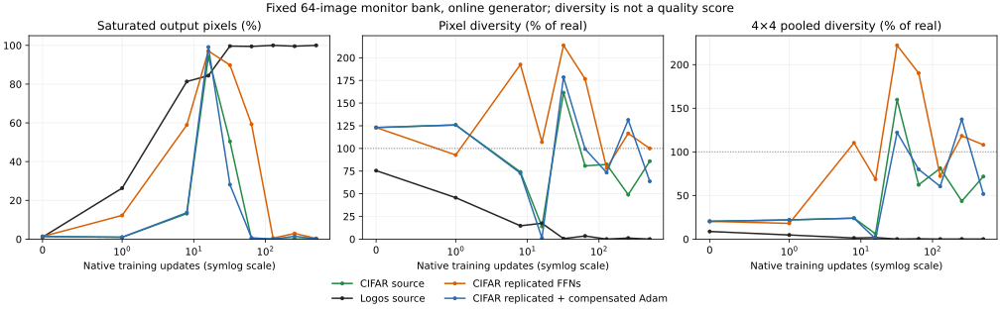

# Healthy CIFAR control: startup saturation can recover

The unchanged CIFAR32 adversarial TransGAN recovers from 94.09% saturation at
step 16 to 0.027% at step 64 and remains unsaturated at step 512. The unchanged
logos128/ResNet pairing does not show comparable recovery in this 512-step window.
A 32-update saturation screen describes startup failure; it does not establish
persistent collapse. In particular, the earlier narrow-FFN and pixelshuffle
variants have not been observed beyond 32 updates.

The second comparison widens the working CIFAR model's four early FFNs to 4096
by replicating units while preserving its initial generator function. This
strongly changes startup under unchanged Adam, but the model also recovers.
Thus early FFN width alone is not sufficient for sustained failure in this
controlled parameterization. It does not rule out independently initialized wide
networks, channel width, depth, data, or interactions with the training recipe.

A subsequent [data-only bridge](DATA_BRIDGE.md) keeps the working32px model and
recipe fixed and changes its data to logos. It retains substantial variation
through 512, so that data change alone does not reproduce the large model failure.
Quality remains unvalidated.

## Results at 512 updates

| Case | Step | Saturation | Pixel diversity / real | 4×4 pooled diversity / real | Pre-tanh RMS |
| --- | ---: | ---: | ---: | ---: | ---: |
| CIFAR source | 512 | 0.2233% | 85.9055% | 71.7402% | 0.5856 |
| Logos128 source | 512 | 100.0000% | 0.0002% | 0.0000% | 49.1780 |
| CIFAR replicated FFNs | 512 | 0.3215% | 100.0115% | 108.0898% | 0.6431 |
| CIFAR replicated + compensated Adam | 512 | 0.1231% | 63.7591% | 51.7267% | 0.4324 |
| CIFAR model on logos32 data | 512 | 37.1994% | 109.2010% | 123.2553% | 3.0075 |

Saturation counts RGB channel values with absolute value above0.99.
These are online-G observations on 64 matched monitor examples, with evolving
prior coordinates and fixed particle IDs/noise. All diversity ratios use that
recipe's real-image bank. Cross-recipe banks/data/resolutions differ. The CIFAR
source and both replication controls share the same bank, prior RNG and
measurement RNG hashes. Fixed-latent results are also retained in every report
and in `outputs.csv`.



## Startup and recovery

| Case | Step | Saturation | Pixel diversity / real | 4×4 pooled diversity / real | Pre-tanh RMS |
| --- | ---: | ---: | ---: | ---: | ---: |
| CIFAR source | 0 | 1.3311% | 123.0589% | 20.3661% | 1.0636 |
| CIFAR source | 1 | 0.9552% | 125.9077% | 21.9914% | 1.0109 |
| CIFAR source | 16 | 94.0877% | 13.9678% | 6.0689% | 4.6119 |
| CIFAR source | 64 | 0.0275% | 80.7823% | 62.2523% | 0.5193 |
| Logos128 source | 0 | 1.0104% | 75.5106% | 8.7081% | 0.9985 |
| Logos128 source | 1 | 26.3122% | 45.6913% | 4.7125% | 2.2417 |
| Logos128 source | 16 | 84.3831% | 17.4525% | 1.7549% | 8.4680 |
| Logos128 source | 64 | 99.4723% | 3.4134% | 0.2998% | 16.1091 |
| CIFAR replicated FFNs | 0 | 1.3311% | 123.0591% | 20.3664% | 1.0636 |
| CIFAR replicated FFNs | 1 | 12.2365% | 92.7717% | 18.0066% | 1.7055 |
| CIFAR replicated FFNs | 16 | 97.1156% | 107.0344% | 68.6482% | 10.6388 |
| CIFAR replicated FFNs | 64 | 59.3063% | 176.6532% | 190.2921% | 4.7621 |
| CIFAR replicated + compensated Adam | 0 | 1.3311% | 123.0591% | 20.3664% | 1.0636 |
| CIFAR replicated + compensated Adam | 1 | 0.9588% | 125.8717% | 21.9959% | 1.0116 |
| CIFAR replicated + compensated Adam | 16 | 99.1369% | 1.0451% | 0.3163% | 5.0769 |
| CIFAR replicated + compensated Adam | 64 | 0.6577% | 99.4360% | 79.9249% | 0.9122 |

Raw pixel diversity is not required to grow monotonically: the healthy source
CIFAR model starts at 123% of real pixel diversity, with only 20% of real pooled
diversity. At 512 it has 86% pixel and 72% pooled diversity. Pooling to 4×4 reduces
fine pixel noise, but still is not a semantic quality metric. Neither high
diversity nor low saturation establishes sample quality; no FID or independent
perceptual validation was run here. These are diagnostic rollouts, not final
training outcomes.

## Where the larger generator diverges

For an activation h, `RMS(h)^2 = RMS(mean_B(h))^2 + mean(var_B(h))` using population
variance. We derive the batch-mean RMS from the two recorded energies. This shared
component can be a spatial template, not merely a flat image or scalar color bias.
Hooks before window folding and after unfolding preserve the original image axis.

| Case | Step | Stage | Batch-mean RMS | Between-image RMS |
| --- | ---: | --- | ---: | ---: |
| CIFAR source | 0 | stage8_block0_ffn | 0.07272 | 0.18276 |
| CIFAR source | 0 | stage8_block1 | 0.16746 | 0.62933 |
| CIFAR source | 0 | stage16_block1 | 0.23507 | 0.68273 |
| CIFAR source | 0 | output_projection | 0.54626 | 0.91258 |
| CIFAR source | 1 | stage8_block0_ffn | 0.07632 | 0.18288 |
| CIFAR source | 1 | stage8_block1 | 0.17853 | 0.62950 |
| CIFAR source | 1 | stage16_block1 | 0.27005 | 0.68279 |
| CIFAR source | 1 | output_projection | 0.44144 | 0.90942 |
| CIFAR source | 512 | stage8_block0_ffn | 0.10040 | 0.32729 |
| CIFAR source | 512 | stage8_block1 | 0.37752 | 0.76139 |
| CIFAR source | 512 | stage16_block1 | 0.59642 | 0.70388 |
| CIFAR source | 512 | output_projection | 0.19690 | 0.55147 |
| Logos128 source | 0 | stage8_block0_ffn | 0.07123 | 0.18427 |
| Logos128 source | 0 | stage8_block1 | 0.14538 | 0.66261 |
| Logos128 source | 0 | stage16_block1 | 0.20092 | 0.64040 |
| Logos128 source | 0 | output_projection | 0.47759 | 0.87690 |
| Logos128 source | 1 | stage8_block0_ffn | 0.10669 | 0.18440 |
| Logos128 source | 1 | stage8_block1 | 0.24262 | 0.66218 |
| Logos128 source | 1 | stage16_block1 | 0.60087 | 0.62720 |
| Logos128 source | 1 | output_projection | 2.08330 | 0.82763 |
| Logos128 source | 512 | stage8_block0_ffn | 0.97373 | 0.21535 |
| Logos128 source | 512 | stage8_block1 | 7.02685 | 0.66391 |
| Logos128 source | 512 | stage16_block1 | 16.66182 | 0.58977 |
| Logos128 source | 512 | output_projection | 49.17070 | 0.84615 |

The larger generator already grows its shared FFN component more in the first
update. Later stages amplify the imbalance between a shared component and
image-dependent variation. Large pre-tanh values then suppress output variation.
Both attention and FFN branch outputs contribute; this is not evidence that only
one layer or the final RGB projection is responsible. Fixed-latent observations
also fail, excluding prior-coordinate motion as the sole explanation of the
observed output collapse, but not excluding prior effects during training.

## A causal parameterization control, not a production fix

The replication screen copies every unchanged tensor exactly, including the
entire discriminator. At 8px each FFN unit is repeated four times; at 16px each
is repeated sixteen times. Each repeated down-weight column is divided by that
factor; down biases remain unchanged. This preserves the starting generator
function in exact arithmetic. Complete-generator CPU float64 checks give maximum
absolute output errors below 6e-15. There are 243 exactly copied tensors and 12
transformed tensors, with matching hashes for the exact copies.

Duplicated units deliberately start identical: this is not an independently
initialized wider network or extra effective capacity. It isolates how the same
function trains under a different parameterization. Adam applies a separate
update to each down-weight copy, so their summed functional update changes with
replication count even though the initial function is unchanged.

The compensated control divides those down-weight learning rates by the
replication factor and divides the corresponding up-layer Adam epsilons by it.
That restores the source functional Adam trajectory in exact arithmetic while
units remain tied. A float64 test verifies eight updates and uncompensated
first-update divergence. On CUDA/TF32 the first compensated update closely matches
the source, but small reduction-order differences accumulate into different
later adversarial trajectories. Do not interpret final rankings as treatment
effect estimates or claim bit-identical long GPU trajectories.

The first logged G loss is about 1.017 in all three CIFAR runs, but the
post-update pre-tanh RMS is 1.0109 for source, 1.7055 for replicated units, and
1.0116 with compensation. Corresponding output saturation is 0.955%, 12.237%,
and 0.959%. Similar scalar loss values therefore do not reveal the different
post-optimizer function response.

This gives evidence of parameterization-dependent startup sensitivity. It is not
a validated width-scaling rule for the independently initialized logos model,
and it is not a Newton/curvature result. No normalization change was made.

## Critic regularization remains a live difference

| Case | Nonzero penalty steps / 64 scheduled | Maximum recorded penalty |
| --- | ---: | ---: |
| CIFAR source | 61 | 1.506455 |
| Logos128 source | 0 | 0.000000 |
| CIFAR replicated FFNs | 60 | 4.470432 |
| CIFAR replicated + compensated Adam | 57 | 2.982608 |
| CIFAR model on logos32 data | 64 | 2.398769 |

The penalty comparison is descriptive, not an intervention: differing real data,
resolution, critic heads and generator trajectory can all affect it. Earlier
critic swaps rule out a DINO-specific explanation, but do not establish that
critic strength or generator–critic interactions are irrelevant. The frozen
ResNet weights remain unchanged in every run.

## Validation and reproduction

Ten focused CPU tests passed (stage-hook/rollback runner, FFN replication
and compensation, and the data bridge). All five 512-update GPU screens completed with full trainer
restoration, unchanged source TOMLs, and matching protected-state hashes before,
after and after restoration. The complete replication preparations also passed
CPU checks for both optimizer modes and restored their optimizer group layouts.
All non-generator CIFAR recipe sections match, except the descriptive name.

Use the specified `transgan-128-env/bin/python`, worktree `PYTHONPATH=src`,
`OMP_NUM_THREADS=1`, `MKL_NUM_THREADS=1`, and physical GPU 0 UUID
`GPU-ed080e41-3193-3755-6756-f3d46c433331` via `CUDA_VISIBLE_DEVICES`:

```text
research/startup_tuning/healthy_control_screen.py --case cifar --device cuda:0 --output-root OUTPUT
research/startup_tuning/healthy_control_screen.py --case logos --device cuda:0 --output-root OUTPUT
research/startup_tuning/replicated_ffn_screen.py --device cuda:0 --output-root OUTPUT
research/startup_tuning/replicated_ffn_screen.py --compensated --device cuda:0 --output-root OUTPUT
```

CIFAR uses its original seed 24002, logos its original seed 25002. No seed sweep.
The logos replay extends the horizon and adds residual branch hooks; it is not
an independent replication used to estimate uncertainty. The CIFAR replication
runs shared GPU 0 with our logos rollout after memory availability was checked;
do not compare elapsed times as hardware benchmarks. GPU 1 remained reserved.
No training checkpoints or persistent jobs were created. PR #382 stays unmerged.

Each subdirectory contains its report, runner snapshot, TOML and fully resolved
HNDL config. Original artifacts: `/mnt/ml7tb/hypergan-signal-research/healthy-control-v1`.
`outputs.csv` and `stages.csv` are reproducible using
`research/startup_tuning/summarize_healthy_controls.py --reports-root OUTPUT --output REPORT_DIR`.
The SVG requires matplotlib; plotting dependencies were installed only into
`/tmp/hypergan-signal-plot-deps`, without changing the training environment.

## Next causal bridge

The [data-only bridge](DATA_BRIDGE.md) is complete. Next, keep its 32px logos data,
critic, prior and optimizer fixed and vary generator channel width, preserving
critic/prior initialization explicitly. Separate width, first upsampling choice,
later depth/resolution and critic geometry. The follow-up report describes a
concrete width case; it has not been run. A robust fix still needs useful diversity,
quality validation and preservation of healthy controls.
